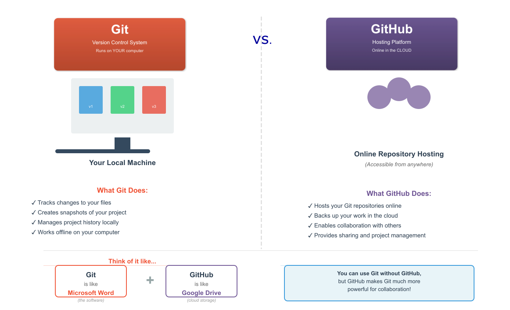

# <h1 align="center">2. Introduction to Git</h1>

    

## Git as a Version Control System

 **Git** is one of the most widely used **distributed version control systems in the world**. It was originally developed by Linus Torvalds in 2005 to manage the Linux kernel’s source code, and has since become essential for software development, research collaboration, and project management across all disciplines.

!!! tip "Using **Git**, you can:"

    - Track every change you make to your files
    - Move backward to previous versions if something goes wrong
    - Collaborate with others without overwriting each other’s work
    - Merge contributions from multiple team members smoothly

## Git vs. GitHub: What's the Difference?

Before we dive deeper, let's clear up a common confusion:

!!! circle-info ""

    

        
    
