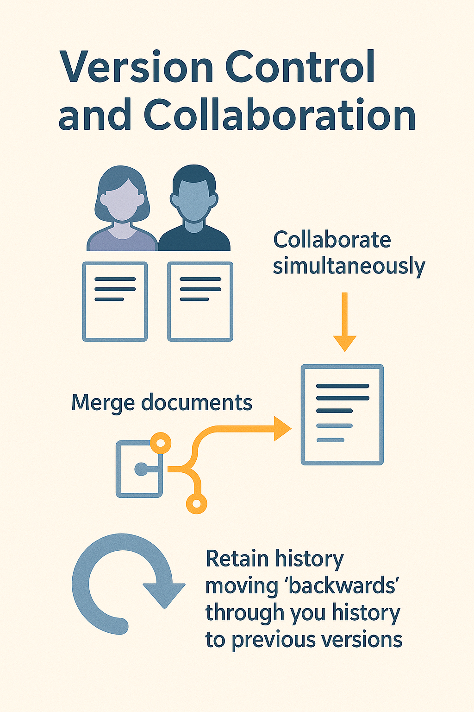

# <h1 align="center">1. Version Control</h1>

<p align="center">
    
</p>


Version control can be used to keep track of versions of a piece of work that either a single person is working on, or a shared document. It is designed to avoid a situation like the one noted below.

!!! quote ""
    ```bash
    mydocument.txt
    mydocumentversion2.txt
    mydocumentwithrevision.txt
    mydocumentfinal.txt
    ```
The system used for naming files may be more or less systematic. Adding dates makes it slightly easier to follow when changes were made:

!!! quote ""
    ```bash
    mydocument2016-01-06.txt
    mydocument2016-01-08.txt
    ```
Though this system might be slightly easier to follow, there are still problems with it. Primarily this system doesn’t record or describe the changes that took place between these two saves. It is possible that some of these changes were small typo fixes but the changes could also have been a major re-write or re-structuring of a document. If you have a change of heart about some of these changes you also need to work out which date the changes were made in order to go back to a previous version.

Version control tries to address problems like these by implementing a systematic approach to recording and managing changes in files. At its simplest, version control involves taking ‘snapshots’ of your file at different stages. This snapshot records information about when the snapshot was made but also about what changes occurred between different snapshots. This allows you to ‘rewind’ your file to an older version. From this basic aim of version control a range of other possibilities are made available.

<p align="center">
    
</p>

## Why Version Control Text Documents?why-version-control-text-documents

As research increasingly makes use of digital tools and storage it becomes important to consider how to best manage our research data. This becomes especially important when we want to collaborate with other people. Though version control was originally designed for dealing with code there are many benefits to using it to with text documents too. Though not all of these benefits will be covered in this lesson, version controlling your document allows you to:

<br>
<p align="center">
    
</p>


Version control is particularly useful for facilitating collaboration. One of the original motivations behind version control systems was to allow different people to work on large projects together, in the case of Git to manage the Linux kernel source code. Using version control to collaborate allows for a greater deal of flexibility and control then many other solutions. As an example it would be possible for two people to work on a document at the same time and then merge these documents. If there were ‘conflicts’ between the two versions version control systems would allow you to see these conflicts and make an active decision about how to ‘merge’ these different versions into a new ‘third’ document. With this approach you would also retain a ‘history’ of the previous version should you wish to revert back to one of these later on.

<br>
<p align="center">
    
</p>

Version control will not be necessary for all of the documents you write. However there are times when version control will be very useful. For substantial work such as articles, books, or dissertations, version control makes a lot of sense.