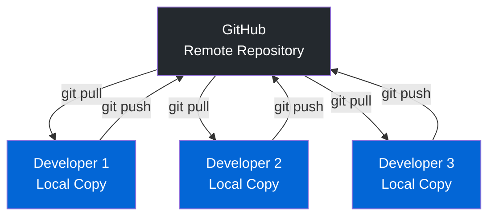
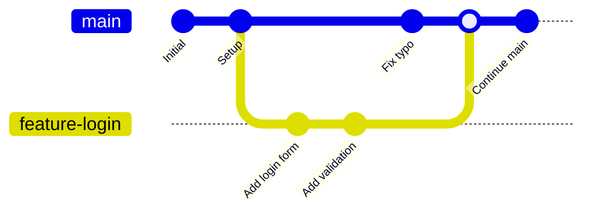
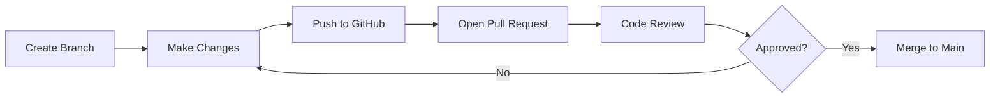

# What is GitHub? 🐙

## Introduction

If **Git** is your local time machine for files, then **GitHub** is the cloud platform where teams collaborate, share, and backup their Git repositories.

---

## GitHub: Git in the Cloud

**GitHub** is a web-based platform built around Git that provides:

- 🌐 **Remote hosting** for your Git repositories
- 👥 **Collaboration tools** for teams
- 🔍 **Code review** through pull requests
- 🐛 **Issue tracking** for bugs and features
- 📊 **Project management** tools
- ⚡ **Automation** with GitHub Actions
- 📚 **Documentation** hosting (GitHub Pages)

!!! info "GitHub vs Git"
    - **Git** = The version control software (local)
    - **GitHub** = The cloud platform for Git (remote)
    
    Think of it like: Email client vs Gmail

---

## How GitHub Works

<iframe src="/docs/assets/git-github-diagrams.html" width="100%" height="900px" style="border: 2px solid #667eea; border-radius: 12px; margin: 20px 0;"></iframe>

### The GitHub Workflow



---

## Key GitHub Concepts

### 1. Remote Repositories

A **remote** is a version of your repository hosted on the internet or network.

#### Setting Up a Remote

```bash
# Check current remotes
$ git remote -v

# Add a remote called "origin"
$ git remote add origin https://github.com/username/repo.git

# View remote details
$ git remote show origin
```

!!! tip "Origin"
    "origin" is the conventional name for the primary remote repository. You can have multiple remotes!

### 2. Clone: Copy a Repository

**Cloning** downloads a complete copy of a repository:

```bash
# Clone a repository
$ git clone https://github.com/username/awesome-project.git

# This creates a folder with:
# - All the files
# - Complete history
# - Automatic remote tracking
```

=== "What Happens"
    ```
    GitHub (Remote)          Your Computer (Local)
    ┌─────────────┐         ┌─────────────┐
    │   Repo      │  clone  │   Repo      │
    │   History   │ ──────> │   History   │
    │   Branches  │         │   Branches  │
    └─────────────┘         └─────────────┘
    ```

=== "After Clone"
    ```bash
    $ cd awesome-project
    $ git remote -v
    origin  https://github.com/username/awesome-project.git (fetch)
    origin  https://github.com/username/awesome-project.git (push)
    ```

### 3. Push: Upload Changes

**Pushing** uploads your local commits to GitHub:

```bash
# Make some commits locally
$ git add .
$ git commit -m "Add new feature"

# Push to GitHub
$ git push origin main
# Uploads your commits to the 'main' branch on 'origin' (GitHub)
```

#### Before Push
```
Local:  A ← B ← C ← D ← E
GitHub: A ← B ← C
```

#### After Push
```
Local:  A ← B ← C ← D ← E
GitHub: A ← B ← C ← D ← E  ✅ Synced!
```

### 4. Pull: Download Changes

**Pulling** downloads changes from GitHub and merges them into your local branch:

```bash
# Get latest changes from GitHub
$ git pull origin main
# Downloads new commits and merges them
```

#### Before Pull
```
Local:  A ← B ← C
GitHub: A ← B ← C ← D ← E (teammate pushed)
```

#### After Pull
```
Local:  A ← B ← C ← D ← E  ✅ Updated!
GitHub: A ← B ← C ← D ← E
```

### 5. Fetch: Download Without Merging

**Fetching** downloads changes but doesn't merge them (safer):

```bash
# Download changes from GitHub
$ git fetch origin

# Review what's new
$ git log origin/main

# Merge when ready
$ git merge origin/main
```

!!! tip "Pull vs Fetch"
    - `git pull` = `git fetch` + `git merge`
    - Use `fetch` when you want to review changes first
    - Use `pull` when you trust the changes

---

## Branching in GitHub

Branches allow parallel development without affecting the main codebase.

### Branch Workflow



### Creating and Pushing Branches

```bash
# Create a new branch
$ git checkout -b feature-login

# Make changes and commit
$ echo "Login page" > login.html
$ git add login.html
$ git commit -m "Add login page"

# Push branch to GitHub
$ git push origin feature-login
# Now others can see your branch on GitHub!
```

### Common Branch Strategies

=== "Feature Branches"
    ```
    main (stable)
      ├─ feature-login
      ├─ feature-dashboard
      └─ feature-payments
    ```
    Each feature gets its own branch

=== "Git Flow"
    ```
    main (production)
      └─ develop (integration)
           ├─ feature-A
           ├─ feature-B
           └─ hotfix-X
    ```
    Structured workflow for releases

=== "GitHub Flow"
    ```
    main (always deployable)
      ├─ feature-1
      ├─ feature-2
      └─ bugfix-3
    ```
    Simple: create branch, merge to main, deploy

---

## Essential GitHub Features

### 1. 🐛 Issues

Track bugs, enhancements, and tasks:

```markdown
**Bug Report**
Title: Login button not working on mobile

**Description:**
When I tap the login button on iPhone, nothing happens.

**Steps to Reproduce:**
1. Open website on iPhone Safari
2. Enter credentials
3. Tap login button

**Expected:** Should log in
**Actual:** Nothing happens
```

**Features:**
- Assign to team members
- Add labels (bug, enhancement, help-wanted)
- Link to commits/PRs
- Add to project boards

### 2. 🔀 Pull Requests (PRs)

Propose changes and get feedback before merging:

#### Pull Request Workflow



#### Creating a Pull Request

=== "Step 1: Push Branch"
    ```bash
    $ git push origin feature-login
    ```

=== "Step 2: Open PR on GitHub"
    ```markdown
    Title: Add login feature
    
    ## Changes
    - Added login form
    - Implemented authentication
    - Added password validation
    
    ## Testing
    - Tested on Chrome, Firefox, Safari
    - Works with existing user database
    
    Closes #42
    ```

=== "Step 3: Review Process"
    - Team reviews code
    - Suggests changes
    - Approves when ready

=== "Step 4: Merge"
    ```bash
    # After approval, merge on GitHub
    # Or via command line:
    $ git checkout main
    $ git merge feature-login
    $ git push origin main
    ```

### 3. ⚡ GitHub Actions

Automate workflows with CI/CD:

```yaml
# .github/workflows/test.yml
name: Run Tests

on: [push, pull_request]

jobs:
  test:
    runs-on: ubuntu-latest
    steps:
      - uses: actions/checkout@v2
      - name: Run tests
        run: npm test
```

**Common Uses:**
- Run tests automatically
- Deploy to production
- Check code quality
- Build documentation

### 4. 📊 Projects

Organize issues and PRs with Kanban boards:

```
To Do          In Progress    Done
────────       ────────────   ──────
Issue #12      Issue #8       Issue #3
Issue #15      PR #9          PR #7
PR #14                        Issue #6
```

### 5. 📚 Wiki & Documentation

- Write documentation in Markdown
- Collaborative editing
- Version controlled
- Searchable

### 6. 🌐 GitHub Pages

Host websites directly from your repository:

```bash
# Your repository
docs/
  ├── index.html
  ├── style.css
  └── script.js

# Becomes: https://username.github.io/repo-name/
```

---

## Collaboration Scenarios

### Scenario 1: Contributing to Open Source

```bash
# 1. Fork the repository on GitHub (your copy)

# 2. Clone YOUR fork
$ git clone https://github.com/YOUR-USERNAME/project.git

# 3. Create a branch
$ git checkout -b fix-typo

# 4. Make changes and commit
$ git commit -m "Fix typo in README"

# 5. Push to YOUR fork
$ git push origin fix-typo

# 6. Open Pull Request on original repository
```

### Scenario 2: Team Development

```bash
# Morning: Get latest changes
$ git pull origin main

# Create feature branch
$ git checkout -b feature-dashboard

# Work on feature
$ git add dashboard.html
$ git commit -m "Add dashboard layout"

# Push regularly to backup
$ git push origin feature-dashboard

# When done: Open PR for review
```

### Scenario 3: Handling Conflicts

When two people edit the same file:

```bash
$ git pull origin main
# Auto-merging index.html
# CONFLICT (content): Merge conflict in index.html

$ git status
# Unmerged paths:
#   both modified:   index.html
```

**Resolve the conflict:**

=== "Before (Conflict)"
    ```html
    <body>
    <<<<<<< HEAD
        <h1>My Title</h1>
    =======
        <h1>Team Title</h1>
    >>>>>>> origin/main
    </body>
    ```

=== "After (Resolved)"
    ```html
    <body>
        <h1>Our Agreed Title</h1>
    </body>
    ```

=== "Complete Resolution"
    ```bash
    # Edit file to resolve
    $ nano index.html
    
    # Mark as resolved
    $ git add index.html
    $ git commit -m "Resolve merge conflict"
    $ git push origin main
    ```

---

## GitHub Best Practices

### Repository Organization

```
my-project/
├── .github/
│   ├── workflows/      # GitHub Actions
│   └── ISSUE_TEMPLATE/ # Issue templates
├── docs/               # Documentation
├── src/                # Source code
├── tests/              # Tests
├── .gitignore          # Files to ignore
├── README.md           # Project overview
├── LICENSE             # License
└── CONTRIBUTING.md     # How to contribute
```

### Writing Good README Files

```markdown
# Project Name

Brief description of what this project does.

## Installation

```bash
npm install
```

## Usage

```bash
npm start
```

## Contributing

Please read CONTRIBUTING.md for details.

## License

MIT License - see LICENSE file
```

### Commit Message Guidelines

```bash
# ✅ Good
$ git commit -m "Add user authentication feature"
$ git commit -m "Fix memory leak in image loader"
$ git commit -m "Update documentation for API v2"

# ❌ Bad
$ git commit -m "fixed stuff"
$ git commit -m "changes"
$ git commit -m "asdf"
```

**Format:**
```
<type>: <subject>

<body>

<footer>
```

**Example:**
```
feat: Add password reset functionality

Implement email-based password reset with:
- Token generation and validation
- Secure email delivery
- Expiration after 1 hour

Closes #123
```

---

## GitHub Alternatives

While GitHub is the most popular, alternatives exist:

| Platform | Best For |
|----------|----------|
| **GitLab** | Self-hosted, built-in CI/CD |
| **Bitbucket** | Jira integration, small teams |
| **Gitea** | Lightweight, self-hosted |
| **SourceForge** | Open source projects |

---

## Try It Yourself! 🎮

### Exercise 1: Create Your First GitHub Repository

1. Go to [github.com](https://github.com)
2. Click "New repository"
3. Name it `my-first-repo`
4. Add a README
5. Click "Create repository"

### Exercise 2: Clone and Push

```bash
# Clone your new repo
$ git clone https://github.com/YOUR-USERNAME/my-first-repo.git
$ cd my-first-repo

# Make a change
$ echo "Hello GitHub!" > hello.txt
$ git add hello.txt
$ git commit -m "Add greeting"

# Push to GitHub
$ git push origin main

# Check GitHub - your file is there!
```

### Exercise 3: Create a Pull Request

```bash
# Create a branch
$ git checkout -b add-feature

# Make changes
$ echo "New feature" > feature.txt
$ git add feature.txt
$ git commit -m "Add new feature"

# Push branch
$ git push origin add-feature

# Go to GitHub and open a Pull Request!
```

---

## Common GitHub Operations Cheat Sheet

```bash
# Clone repository
git clone <url>

# Check status
git status

# Pull latest changes
git pull origin main

# Create and switch to new branch
git checkout -b feature-name

# Push branch to GitHub
git push origin feature-name

# Update your fork from original
git remote add upstream <original-repo-url>
git fetch upstream
git merge upstream/main

# Delete remote branch
git push origin --delete feature-name

# View all branches (including remote)
git branch -a
```

---

## What's Next?

Now you understand how GitHub enables collaboration. Let's explore remote repositories in more detail.

<div class="grid" markdown>

[← Back: Git Workflow](../basics/git-workflow.md){ .md-button }
[Next: Remote Repositories →](remotes.md){ .md-button .md-button--primary }

</div>

---

!!! tip "Key Takeaways"
    - ✅ GitHub hosts Git repositories in the cloud
    - ✅ `git clone` copies a repository
    - ✅ `git push` uploads your commits
    - ✅ `git pull` downloads and merges changes
    - ✅ Pull Requests enable code review
    - ✅ Issues track bugs and features
    - ✅ Branches allow parallel development
    - ✅ GitHub Actions automate workflows
