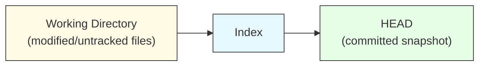
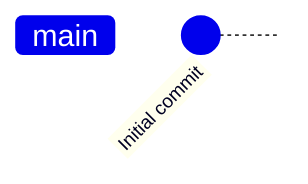

# <h1 align="center">4. Git Concepts, Data Model and Commands 🎨</h1>

<p align="center">
    
</p>


<h2 align="center">Version Control for Cell Clusters — A Git Journey in the Lab</h2>

Dr. Lin is a computational biologist working on a new single-cell RNA sequencing (scRNA-seq) pipeline.
Like most data scientists, their workflow involves constant tweaking: preprocessing, quality control, normalization, clustering, and visualization.

They are tired of lost scripts, mysterious file versions like `clustering_final_FINAL.R`, and overwritten notebooks.

So, they decided to version-control their pipeline properly using **Git**

### 1. `git init` - Starting a new experiment 

They begin their project as they would a new experiment — setting up a clean workspace.

!!! terminal ""

    ```bash
    mkdir CellCulsterFlow
    cd CellClusterFlow
    ```
    
    ```bash
    git init
    ```
This initialises an empty Git repository, like labeling an empty freezer box before adding samples.
Every change from here on will be tracked.

They create few essential files 

```bash
README.md
LICENSE
data_preprocessing.py
qc_filtering.py
clustering.R
visualization.ipynb
```


### 2. `git status` — Checking the lab bench

Just like checking which samples are unprocessed, they inspects their project’s state.

!!! terminal ""
    ```bash
    git status
    ```

Git reports untracked files — nothing is committed yet.
This command becomes a habit; they run it before almost every operation.




### 3. `git add` — Staging files for the record

Like labeling tubes before freezing them, they stages files to prepare for a permanent record.

```bash
git add README.md LICENSE
git add .
```


This moves files from the working directory into the staging area, also known as the index.
Only staged files will be committed.

### 4. `git commit` — Recording the experiment

They  capture their first snapshot.

```bash
git commit -m "Initial commit: basic pipeline structure"
```

This is their first “frozen sample” — They can always revert to it later.


