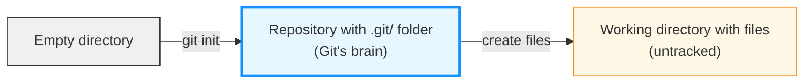
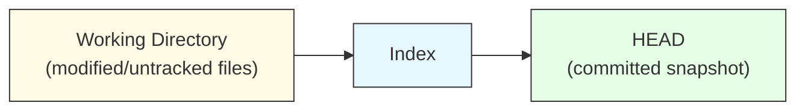
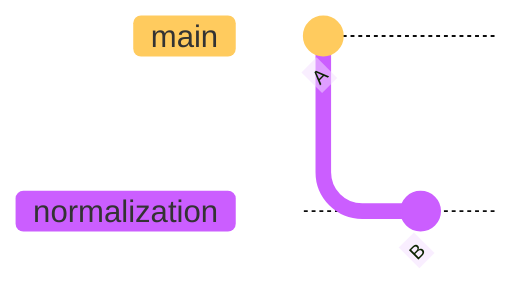
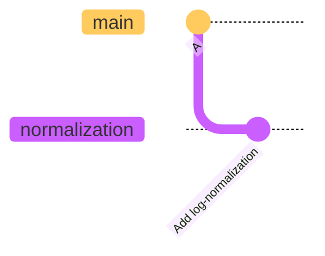
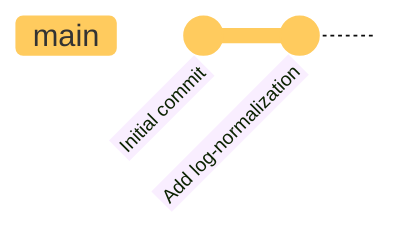
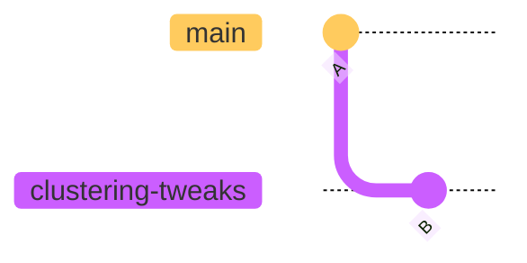
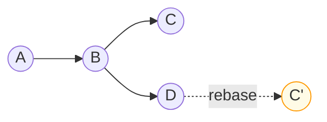
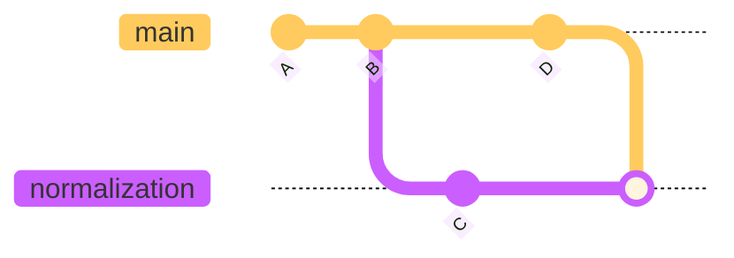
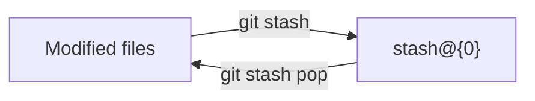
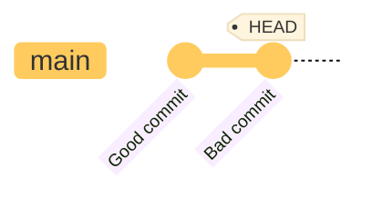

# <h1 align="center">4. Git Concepts, Data Model and Commands</h1>

<p align="center">
    
</p>


<h2 align="center">Version Control for Cell Clusters — A Git Journey in the Lab</h2>

Dr. X is a computational biologist working on a new single-cell RNA sequencing (scRNA-seq) pipeline.
Like most data scientists, their workflow involves constant tweaking: preprocessing, quality control, normalization, clustering, and visualization.

They are tired of lost scripts, mysterious file versions like `clustering_final_FINAL.R`, and overwritten notebooks.

So, they decided to version-control their pipeline properly using **Git**

### 1. `git init` - Starting a new experiment 

They begin their project as they would a new experiment — setting up a clean workspace.

!!! terminal ""

    ```bash
    mkdir CellClusterFlow
    cd CellClusterFlow
    ```
    
    ```bash
    git init
    ```
    !!! success "Output"
        ```bash
        Initialized empty Git repository in /path/to/CellClusterFlow/.git/
        ```

    
This initialises an empty Git repository, like labeling an empty freezer box before adding samples.
Every change from here on will be tracked.

### What just happened? The `.git` directory

The `git init` command created a hidden `.git` directory — the heart of your repository.

!!! terminal ""
    ```bash
    ls -la
    ```

    **Output:**
    ```
    drwxr-xr-x  .git/
    ```

    * This `.git` folder is Git's "lab notebook" — it contains:

    ```bash
    .git/
    ├── HEAD              # Points to current branch
    ├── config            # Repository settings
    ├── description       # Repository description (rarely used)
    ├── branches/         # (deprecated, legacy Git)
    ├── hooks/            # Scripts triggered by Git events
    ├── info/             # Additional repository information (excludes, attributes)
    ├── objects/          # Database of all file versions (commits, trees, blobs)
    └── refs/             # Pointers to commits (branches, tags)
        ├── heads/        # Local branches
        └── tags/         # Version tags
    ```

!!! warning "Never delete `.git`!"
      Deleting this folder erases **all** version history. Your files remain, but Git forgets everything — like burning your lab notebook while keeping only today's samples.

!!! tip "Checking if a directory is a Git repository"
    ```bash
        # If .git exists, you're in a Git repo
        ls -la .git

        # Or use Git itself with git status command which we will cover next
        # If not a repo: "fatal: not a git repository"
    ```

### Creating essential files

Dr. X sets up the initial project structure:

!!! terminal-2 "Create a mock file-set"
    ```bash
    touch README.md LICENSE data_preprocessing.py qc_filtering.py clustering.R visualization.ipynb
    ```

**Files created:**
```
CellClusterFlow/
├── .git/                    # Git's database (hidden)
├── README.md                # Project documentation
├── LICENSE                  # Usage terms
├── data_preprocessing.py    # Data loading and cleaning
├── qc_filtering.py          # Quality control filters
├── clustering.R             # Clustering algorithms
└── visualization.ipynb      # Plotting and figures
```

At this point, Git **knows** these files exist (they're in the working directory), but isn't **tracking** them yet. 

That's what `git add` will do next.


!!! info "Working directory vs Repository"
    - **Working directory**: The files you can see and edit
    - **Repository** (`.git/`): Git's internal database of all versions
    
    Think of it like:
    - **Working directory** = Your lab bench (current experiment)
    - **Repository** = Your archived lab notebooks (all past experiments)


### 2. `git status` — Checking the lab bench

Just like checking which samples are unprocessed, they inspects their project’s state.

!!! terminal ""
    ```bash
    git status
    ```
    
    ??? success "Output"

        ```bash
        On branch main

        No commits yet

        Untracked files:
          (use "git add <file>..." to include in what will be committed)
        	LICENSE
        	README.md
        	clustering.R
        	data_preprocessing.py
        	qc_filtering.py
        	visualization.ipynb

        nothing added to commit but untracked files present (use "git add" to track)
        ```
Git reports untracked files — nothing is committed yet.
This command should become a habit; they run it before almost every operation.




### 3. `git add` — Staging files for the record

Like labeling tubes before freezing them, they stages files to prepare for a permanent record.

```bash
git add README.md LICENSE
git add .
```


This moves files from the working directory into the staging area, also known as the index.
Only staged files will be committed.

### 4. `git commit` — Recording the experiment

They  capture their first snapshot.

!!! terminal ""
    ```bash
    git commit -m "Initial commit: basic pipeline structure"
    ```

    ??? success "Output"

        ```bash
        [main (root-commit) 40eb049] Initial commit: basic pipeline structure
         6 files changed, 0 insertions(+), 0 deletions(-)
         create mode 100644 LICENSE
         create mode 100644 README.md
         create mode 100644 clustering.R
         create mode 100644 data_preprocessing.py
         create mode 100644 qc_filtering.py
         create mode 100644 visualization.ipynb
        ```

    This is their first “frozen sample” — They can always revert to it later.

    <center>
    ```mermaid
    %%{init: {'theme':'base'}}%%
    gitGraph
      commit id: "Initial commit"
    ```
    </center>

### 5. `git branch` — Designing new experiments

To test a new normalization method, they create a new branch — a safe environment to experiment without contaminating their main results.

```bash
git branch normalisation
git checkout normalisation
```

Branches in Git are like running parallel experiments in separate tubes.
Each can evolve independently until they decide to merge the results.

<center>

</center>

### 6. `git status`, `git add`, and `git commit` again

After modifying **data_preprocessing.py** to include log-normalization, they check the progress:

```bash
git status
git add data_preprocessing.py
git commit -m "Add log-normalization step for scRNA-seq data"
```


Now, their new branch contains a reproducible change.
<center>

</center>

### 7. `git log` — Reviewing experimental history

Every scientist keeps lab notes; Git is no different.

```bash
git log --oneline --graph --decorate
```

It shows a tidy, timestamped list of commits — their computational “lab notebook”.

<center>

</center>


### 10. `git checkout` — Switching branches

To review another experiment, Dr. X switches branches. ( make sure the current branch is `normalisation` )

```bash
git branch

  main
* normalisation

```

Create a new branch ( branch namem is `clustering-tweaks` and check it out one line)

```bash
git checkout -b clustering-tweaks
```

This is like changing which dataset or parameter set they are exploring — safely isolated.

<center>

</center>

### 11. `git push` — Publishing results

When they are satisfied with their log-normalization implementation, they share it.

```bash
git push origin normalization
```

Now Dr.Y and the rest of the lab can review her branch and incorporate it into the shared project.


### 12. `git rebase` — Keeping history tidy

After a few days, `main` has moved ahead.
Rather than `merge` and **create** messy branches, Dr.X  rebases their branch to make history look clean.

```bash
git checkout normalization
git rebase main
```


This reapplies their commits on top of the latest base — as if they had started from the most recent code.

<center>

</center>

<center>

</center>

### 13. `git stash` — Pausing unfinished work

Midway through plotting, Dr. X gets a Slack message: “Can you quickly check that clustering bug?”
Their notebook isn’t ready to commit, but they don't want to lose their changes.

```bash
git stash
```

Their work is saved safely on the “stash stack,” and their working directory is clean again.

After debugging, they brings their changes back:

```bash
git stash pop
```

<center>

</center>

### 14. `git reset` — Undoing a mistake

Oops — Dr.X accidentally committed a large **matrix.mtx** test file.
They unstage it first:

```bash
git reset matrix.mtx
```

Then remove the bad commit:

```bash
git reset --soft HEAD^
```

If they want to completely delete it (be careful!):

```bash
git reset --hard HEAD^
```

Reset moves the “HEAD pointer” to a previous commit — like discarding a failed experiment and reverting to known-good results.

<center>

</center>


## Common Questions


??? question "Why do I need the staging area? Can't I just commit directly?"
    The staging area gives you control! You can:
    
    - Commit only related changes together
    - Review changes before committing
    - Keep work-in-progress unstaged
    - Create clean, logical commit history
    
    Many Git tools allow skipping staging (`git commit -a`), but understanding it makes you a better Git user.

??? question "What's the difference between Git and GitHub?"
    - **Git** = Version control software (runs on your computer)
    - **GitHub** = Website for hosting Git repositories (in the cloud)
    
    Think of it like:
    - Git = Microsoft Word
    - GitHub = Google Docs
    
    We'll cover GitHub in detail later!

??? question "Can I use Git for non-code projects?"
    Absolutely! Git works great for:
    
    - Documentation (Markdown, LaTeX)
    - Design files (if text-based)
    - Configuration files
    - Writing (books, articles)
    - Any text files that change over time

??? question "How much space does Git use?"
    Git is surprisingly efficient! It:
    
    - Compresses data
    - Stores only changes (internally)
    - Removes duplicates
    
    A repo with years of history might only be a few MB.