# <h1 align="center">4. Git Concepts, Data Model and Commands 🎨</h1>

<p align="center">
    
</p>


<h2 align="center">Version Control for Cell Clusters — A Git Journey in the Lab</h2>

Dr. X is a computational biologist working on a new single-cell RNA sequencing (scRNA-seq) pipeline.
Like most data scientists, their workflow involves constant tweaking: preprocessing, quality control, normalization, clustering, and visualization.

They are tired of lost scripts, mysterious file versions like `clustering_final_FINAL.R`, and overwritten notebooks.

So, they decided to version-control their pipeline properly using **Git**

### 1. `git init` - Starting a new experiment 

They begin their project as they would a new experiment — setting up a clean workspace.

!!! terminal ""

    ```bash
    mkdir CellCulsterFlow
    cd CellClusterFlow
    ```
    
    ```bash
    git init
    ```
This initialises an empty Git repository, like labeling an empty freezer box before adding samples.
Every change from here on will be tracked.

They create few essential files 

```bash
README.md
LICENSE
data_preprocessing.py
qc_filtering.py
clustering.R
visualization.ipynb
```


### 2. `git status` — Checking the lab bench

Just like checking which samples are unprocessed, they inspects their project’s state.

!!! terminal ""
    ```bash
    git status
    ```

Git reports untracked files — nothing is committed yet.
This command becomes a habit; they run it before almost every operation.


### 3. `git add` — Staging files for the record

Like labeling tubes before freezing them, they stages files to prepare for a permanent record.

```bash
git add README.md LICENSE
git add .
```


This moves files from the working directory into the staging area, also known as the index.
Only staged files will be committed.

### 4. `git commit` — Recording the experiment

They  capture their first snapshot.

```bash
git commit -m "Initial commit: basic pipeline structure"
```

This is their first “frozen sample” — They can always revert to it later.


### 5. `git branch` — Designing new experiments

To test a new normalization method, they create a new branch — a safe environment to experiment without contaminating their main results.

```bash
git branch normalization
git checkout normalization
```

Branches in Git are like running parallel experiments in separate tubes.
Each can evolve independently until they decide to merge the results.


### 6. `git status`, `git add`, and `git commit` again

After modifying **data_preprocessing.py** to include log-normalization, they check the progress:

```bash
git status
git add data_preprocessing.py
git commit -m "Add log-normalization step for scRNA-seq data"
```


Now, their new branch contains a reproducible change.


### 7. `git log` — Reviewing experimental history

Every scientist keeps lab notes; Git is no different.

```bash
git log --oneline --graph --decorate
```

It shows a tidy, timestamped list of commits — their computational “lab notebook”.


### 8. `git fetch` — Getting updates from collaborators

Their collaborator Dr. Y pushes changes to **qc_filtering.py** on the shared repository.
Before pulling them in, they fetches to see what’s changed.

```bash
git fetch origin
```


Fetching updates to their remote tracking branches (like checking a shared Google Sheet without overwriting your own copy).


### 9. `git pull` — Syncing the latest version

Now they merge Dr.Y's updates into their local repository.

```bash
git pull origin main
```

This performs a `fetch` + `merge`.
Their local branch is now aligned with the shared main.


### 10. `git checkout` — Switching branches

To review another experiment, Dr. X switches branches.

```bash
git checkout normalisation
```

Or to create a new one in one step:

```bash
git checkout -b clustering-tweaks
```

This is like changing which dataset or parameter set they are exploring — safely isolated.


### 11. `git push` — Publishing results

When they are satisfied with their log-normalization implementation, they share it.

```bash
git push origin normalization
```

Now Dr.Y and the rest of the lab can review her branch and incorporate it into the shared project.


### 12. `git rebase` — Keeping history tidy

After a few days, `main` has moved ahead.
Rather than `merge` and **create** messy branches, Dr.X  rebases their branch to make history look clean.

```bash
git checkout normalization
git rebase main
```


This reapplies their commits on top of the latest base — as if they had started from the most recent code.


### 13. `git stash` — Pausing unfinished work

Midway through plotting, Dr. X gets a Slack message: “Can you quickly check that clustering bug?”
Their notebook isn’t ready to commit, but they don't want to lose their changes.

```bash
git stash
```

Their work is saved safely on the “stash stack,” and their working directory is clean again.

After debugging, they brings their changes back:

```bash
git stash pop
```


### 14. `git reset` — Undoing a mistake

Oops — Dr.X accidentally committed a large **matrix.mtx** test file.
They unstage it first:

```bash
git reset matrix.mtx
```

Then remove the bad commit:

```bash
git reset --soft HEAD^
```

If they want to completely delete it (be careful!):

```bash
git reset --hard HEAD^
```

Reset moves the “HEAD pointer” to a previous commit — like discarding a failed experiment and reverting to known-good results.


### 15. `git merge` — Combining branches (and resolving conflicts)

Once testing is complete, Dr.X merges her branch back into main.

```bash
git checkout main
git merge normalization
```

#### When conflicts arise — A realistic scenario

While Dr. X was working on log-normalization in the `normalization` branch, Dr. Y was simultaneously updating the same `data_preprocessing.py` file on `main` to add a different scaling method. Now, when Dr. X tries to merge:

!!! terminal "error"

    ```bash
        Auto-merging data_preprocessing.py
        CONFLICT (content): Merge conflict in data_preprocessing.py
        Automatic merge failed; fix conflicts and then commit the result.
    ```

Git cannot automatically decide which changes to keep — just like two scientists editing different parts of the same methods section in a manuscript.

#### Anatomy of a conflict

Opening `data_preprocessing.py`, Dr. X sees conflict markers:
```python
def normalize_counts(adata):
    """Normalize raw count data"""
<<<<<<< HEAD
    # Dr. Y's changes on main branch
    sc.pp.scale(adata, max_value=10)
    print("Applied scaling normalization")
=======
    # Dr. X's changes on normalization branch
    sc.pp.log1p(adata)
    print("Applied log-normalization")
>>>>>>> normalization
    return adata
```

The conflict markers show:
- `<<<<<<< HEAD`: Current branch (main) version
- `=======`: Separator between the two versions
- `>>>>>>> normalization`: Incoming branch version

#### Resolving the conflict

Dr. X realises both normalizations are valuable and should be applied sequentially. They manually edit the file:
```python
def normalize_counts(adata):
    """Normalize raw count data"""
    # Apply both normalization steps
    sc.pp.log1p(adata)
    sc.pp.scale(adata, max_value=10)
    print("Applied log-normalization followed by scaling")
    return adata
```

#### Completing the merge

After resolving all conflicts:

!!! terminal ""

    ```bash
        # Check which files had conflicts
        git status
        
        # Stage the resolved file
        git add data_preprocessing.py
        
        # Complete the merge with a commit
        git commit -m "Merge normalization branch: combine log and scale methods"
    ```

!!! tip "Conflict prevention tips"
    - Communicate with collaborators about which files you're editing
    - Pull frequently to stay synchronized: `git pull origin main`
    - Keep branches short-lived and focused
    - Use `git fetch` + `git diff origin/main` to preview incoming changes


#### Advanced: Using merge tools

For complex conflicts, Dr. X can use visual merge tools:
```bash
# Configure a merge tool (e.g., VS Code, Meld, or vimdiff)
git config --global merge.tool vscode
git config --global mergetool.vscode.cmd 'code --wait --diff $LOCAL $REMOTE'

# Launch the merge tool
git mergetool
```

This opens a side-by-side comparison, making it easier to see differences and choose the correct resolution.

```mermaid
flowchart TB
  A[Merge conflict detected] --> B{Conflict complexity?}
  B -->|Simple| C[Manual editing]
  B -->|Complex| D[Visual merge tool]
  C --> E[git add file]
  D --> E
  E --> F[git commit]
  F --> G[Merge complete ✓]
  style A fill:#ffe6e6,stroke:#f00
  style G fill:#e6ffe6,stroke:#0f0
```
