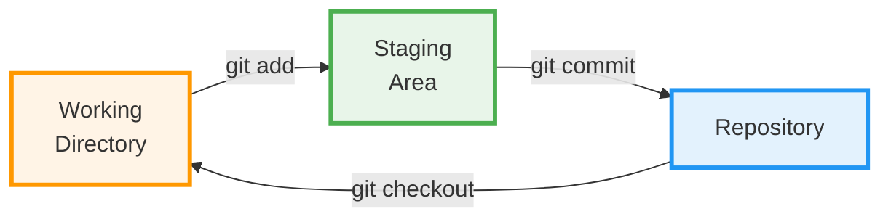
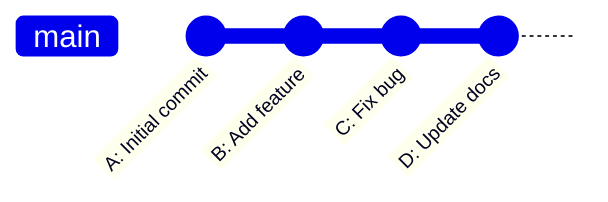
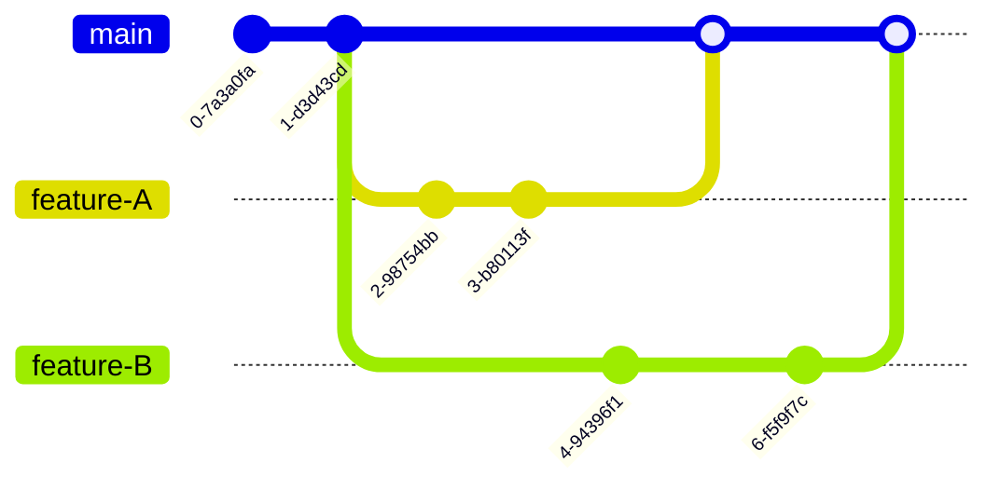

# 4. What is Git? 🎨

## Introduction

**Git** is a distributed version control system created by Linus Torvalds in 2005 (yes, the same person who created Linux!). It's designed to handle everything from small to very large projects with speed and efficiency.

---

## Git in Simple Terms

Think of Git as a **sophisticated time machine** for your files that:

- 📸 Takes snapshots of your project at different points in time
- 🔄 Lets you travel back to any snapshot
- 🌿 Allows you to create parallel timelines (branches)
- 🤝 Helps multiple people work together without chaos

---

## The Git Workflow

Git has a three-stage architecture that gives you precise control over what gets saved in your project history.

<iframe src="../../assets/diagrams/git-github-diagrams.html#diagram-2" width="100%" height="700px" style="border: 2px solid #667eea; border-radius: 12px; margin: 20px 0;"></iframe>

### The Three States

Every file in Git exists in one of three states:

#### 1. 📁 Working Directory

This is your **workspace** - where you actually edit files.

```bash
# Your project folder
my-project/
├── index.html      ← Edit this file
├── style.css       ← Make changes here
└── script.js       ← Work on your code
```

!!! info "Working Directory"
    - Where you make changes to files
    - Just a normal folder on your computer
    - Changes here are NOT tracked yet

#### 2. 📋 Staging Area (Index)

This is the **preparation zone** - where you choose which changes to include in your next commit.

```bash
# You edited 5 files, but only want to commit 3
$ git add index.html style.css
# Now these 2 files are "staged" and ready to commit
```

!!! tip "Why Staging?"
    The staging area lets you craft **perfect commits**. You can:
    
    - Group related changes together
    - Commit features one at a time
    - Review changes before committing
    - Leave unfinished work unstaged

#### 3. 🗄️ Repository (Local Repo)

This is your **permanent history** - where Git stores all committed snapshots.

```bash
$ git commit -m "Add login feature"
# Your staged changes are now permanently saved in Git's history
```

!!! success "Repository"
    - Complete project history
    - Stored in the hidden `.git` folder
    - Can recover any previous version
    - Shareable with others

---

## The Basic Git Workflow

Here's how the typical workflow looks:

### Step-by-Step Example

=== "Step 1: Modify Files"
    ```bash
    # Edit your files in the working directory
    $ nano index.html  # Make some changes
    ```
    
    **Status**: Changes are in Working Directory ⚠️ (not tracked)

=== "Step 2: Stage Changes"
    ```bash
    # Add files to staging area
    $ git add index.html
    ```
    
    **Status**: Changes are Staged ✓ (ready to commit)

=== "Step 3: Commit"
    ```bash
    # Commit staged changes with a message
    $ git commit -m "Update homepage header"
    ```
    
    **Status**: Changes are Committed 🎉 (saved in history)

=== "Step 4: Repeat"
    ```bash
    # Continue working...
    $ nano style.css      # Modify
    $ git add style.css   # Stage
    $ git commit -m "Fix button colors"  # Commit
    ```

---

## Visualizing the Workflow



---

## Real-World Example

Let's say you're building a website and working on multiple features:

### Scenario: Multiple Changes

```bash
# You made changes to 4 files
$ git status
Modified:   header.html
Modified:   footer.html
Modified:   login.js
Modified:   debug.js
```

#### Option 1: Commit Everything (Not Recommended)

```bash
$ git add .
$ git commit -m "Various changes"
# ❌ Unclear what changed and why
```

#### Option 2: Selective Staging (Best Practice)

```bash
# Commit related changes together
$ git add header.html footer.html
$ git commit -m "Update navigation menu styling"

$ git add login.js
$ git commit -m "Fix login validation bug"

# Leave debug.js unstaged (still testing)
```

!!! success "Clean History"
    Now your history is clear, organized, and easy to understand!

---

## Key Git Concepts

### Commits: Snapshots, Not Diffs

Git stores **complete snapshots** of your project, not just the differences.

=== "Traditional VCS (Diff-based)"
    ```
    Version 1: Full file
    Version 2: + Added line 5
    Version 3: - Deleted line 12
    ```

=== "Git (Snapshot-based)"
    ```
    Version 1: Complete snapshot
    Version 2: Complete snapshot
    Version 3: Complete snapshot
    (Git is smart: only stores changes, but thinks in snapshots)
    ```

### The `.git` Directory

When you initialize a Git repository, Git creates a hidden `.git` folder:

```bash
my-project/
├── .git/              ← Git's "brain" (don't touch!)
│   ├── objects/       ← All your snapshots
│   ├── refs/          ← Branches and tags
│   ├── HEAD           ← Current branch pointer
│   └── config         ← Repository settings
├── index.html
└── style.css
```

!!! danger "Never Delete .git!"
    The `.git` folder contains your entire project history. Deleting it means losing all Git data!

---

## Git's Data Model

### Everything is a Commit



Each commit contains:

```yaml
Commit: a3f5d9c
Author: Jane Doe <jane@example.com>
Date: Mon Oct 30 14:32:18 2025
Message: "Add login feature"

Changes:
  - login.html (new file)
  - app.js (modified)
  
Parent: b2e4c8a  ← Points to previous commit
```

### Commits Form a Timeline

```
(Earlier) ← A ← B ← C ← D → (Latest)
```

Each commit knows its parent, creating an unbreakable chain of history.

---

## What Makes Git Special?

### 1. **Speed** ⚡

Most operations are local (no network needed):

```bash
$ git log        # Instant!
$ git diff       # Instant!
$ git checkout   # Instant!
```

### 2. **Branching** 🌿

Create branches in milliseconds:

```bash
$ git branch feature-login    # Creates a branch
$ git checkout feature-login  # Switches to it
# Or both at once:
$ git checkout -b feature-login
```

### 3. **Distributed** 🌍

Every developer has the full history:

```
Developer 1 Computer → Full history
Developer 2 Computer → Full history  
GitHub Server → Full history
```

### 4. **Data Integrity** 🔒

Every file and commit is checksummed:

```bash
commit a3f5d9c847e829013abc9873...
# This hash is calculated from the commit contents
# Any change = different hash
# Impossible to corrupt without Git knowing
```

### 5. **Non-Linear Development** 🔀

Work on multiple features simultaneously:



---

## Git Commands Overview

Here's a quick preview of essential commands (we'll learn these in detail later):

### Setup & Configuration
```bash
git config --global user.name "Your Name"
git config --global user.email "you@example.com"
```

### Creating Repositories
```bash
git init          # Create new repo
git clone <url>   # Copy existing repo
```

### Basic Workflow
```bash
git status        # Check what's changed
git add <file>    # Stage changes
git commit -m "Message"  # Save snapshot
```

### History & Exploration
```bash
git log           # View commit history
git diff          # See changes
git show <commit> # View specific commit
```

---

## Try It Yourself! 🎮

### Exercise 1: Create Your First Repository

Open your terminal and try this:

```bash
# Create a new directory
$ mkdir my-first-repo
$ cd my-first-repo

# Initialize Git
$ git init
# Output: Initialized empty Git repository in /path/to/my-first-repo/.git/

# Check status
$ git status
# Output: On branch main
#         No commits yet
#         nothing to commit
```

!!! success "Congratulations!"
    You just created your first Git repository! The `.git` folder now exists (it's hidden, so use `ls -la` to see it).

### Exercise 2: Understand the Three States

```bash
# Create a file (Working Directory)
$ echo "Hello Git!" > hello.txt
$ git status
# Output: Untracked files: hello.txt

# Stage the file (Staging Area)
$ git add hello.txt
$ git status
# Output: Changes to be committed: new file: hello.txt

# Commit (Repository)
$ git commit -m "Add greeting file"
$ git status
# Output: nothing to commit, working tree clean
```

---

## Common Questions

??? question "Why do I need the staging area? Can't I just commit directly?"
    The staging area gives you control! You can:
    
    - Commit only related changes together
    - Review changes before committing
    - Keep work-in-progress unstaged
    - Create clean, logical commit history
    
    Many Git tools allow skipping staging (`git commit -a`), but understanding it makes you a better Git user.

??? question "What's the difference between Git and GitHub?"
    - **Git** = Version control software (runs on your computer)
    - **GitHub** = Website for hosting Git repositories (in the cloud)
    
    Think of it like:
    - Git = Microsoft Word
    - GitHub = Google Docs
    
    We'll cover GitHub in detail later!

??? question "Can I use Git for non-code projects?"
    Absolutely! Git works great for:
    
    - Documentation (Markdown, LaTeX)
    - Design files (if text-based)
    - Configuration files
    - Writing (books, articles)
    - Any text files that change over time

??? question "How much space does Git use?"
    Git is surprisingly efficient! It:
    
    - Compresses data
    - Stores only changes (internally)
    - Removes duplicates
    
    A repo with years of history might only be a few MB.

---

## What's Next?

Now that you understand what Git is and its three-stage workflow, let's dive deeper into the actual workflow in practice.

<div class="grid" markdown>

[← Back: Version Control](version-control.md){ .md-button }
[Next: Git Workflow →](git-workflow.md){ .md-button .md-button--primary }

</div>

---

!!! tip "Key Takeaways"
    - ✅ Git is a distributed version control system
    - ✅ Three stages: Working Directory → Staging Area → Repository
    - ✅ `git add` moves changes to staging
    - ✅ `git commit` saves staged changes permanently
    - ✅ Every commit is a complete snapshot
    - ✅ Git is fast, efficient, and reliable
