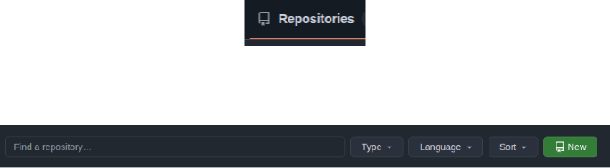
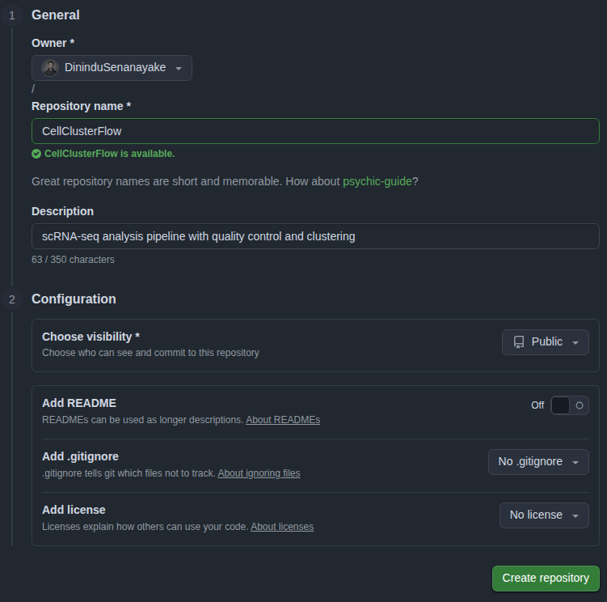

# <h1 align="center">5. From Local to Collaborative — GitHub</h1>

<p align="center">
    
</p>

<h2 align="center">Taking CellClusterFlow from Solo to Collaborative Science</h2>

Dr. X has been happily using Git locally to track their scRNA-seq pipeline. But science is collaborative, and their colleague Dr. Y wants to contribute. A postdoc from another institution saw their presentation and wants to try the pipeline. Their PI asks, "Can you share this with the lab?"

**Git tracks changes. GitHub shares them.**

It's time to move from local version control to collaborative development using **GitHub**.

---

## What is GitHub?

Think of Git as your personal lab notebook, and GitHub as a shared lab server where everyone can:
- 📤 **Upload** their notebooks (repositories)
- 👀 **View** others' work
- 🔄 **Sync** changes across the team
- 💬 **Discuss** methods and results
- 🐛 **Report** issues and bugs

GitHub is a **hosting platform** for Git repositories with powerful collaboration features built on top.

!!! circle-info "Git ≠ GitHub"
    - **Git**: Version control system (the tool)
    - **GitHub**: Web-based hosting service (the platform)
    - Alternatives exist: GitLab, Bitbucket, but GitHub is the most popular in research

---

## 1. Creating a Repository on GitHub

Dr. X signs up at [github.com](https://github.com) and creates a new repository.

### On GitHub's website:

1. Click the <kbd>Repositories</kbd> → <kbd style="background-color: green; color: white;">New</kbd>
    <p align="center">
        
    </p>
2. Name it: `CellClusterFlow`
3. Add description: `scRNA-seq analysis pipeline with quality control and clustering`
4. Choose **Public** (open science!) or **Private** (for unpublished work)
5. Skip "Initialize with README" — they already have local files
6. Click **"Create repository"**
````mermaid
flowchart LR
  A[Local Git repo] -->|git remote add| B[GitHub remote]
  B -->|git push| C[Public/Private repo on GitHub]
  style A fill:#e6f7ff,stroke:#333
  style B fill:#fff7e6,stroke:#333
  style C fill:#e6ffe6,stroke:#333
````

<p align="center">
    
</p>

---

## 2. Connecting Local Repository to GitHub

GitHub provides a remote URL. Dr. X connects their local repository to this remote:

!!! terminal ""
````bash
    # Add GitHub as a remote called "origin"
    git remote add origin https://github.com/DrX/CellClusterFlow.git
    
    # Verify the connection
    git remote -v
````

**Output:**
````
origin  https://github.com/DrX/CellClusterFlow.git (fetch)
origin  https://github.com/DrX/CellClusterFlow.git (push)
````

Think of `origin` as a nickname for the remote repository — like saving "Lab Server" in your file browser.

---

## 3. `git push` — Uploading Your Work

Time to share! Dr. X pushes their commits to GitHub:

!!! terminal ""
````bash
    # Push the main branch to origin
    git push -u origin main
````

The `-u` flag sets `origin/main` as the default upstream, so future pushes only need `git push`.
````mermaid
sequenceDiagram
    participant Local as Local Repository
    participant GitHub as GitHub (origin)
    
    Local->>GitHub: git push origin main
    GitHub-->>Local: ✓ Commits uploaded
    Note over GitHub: Now visible to collaborators
````

**What just happened?**
- All commits from `main` are now on GitHub
- Anyone with access can see the code, history, and documentation
- The repository has a permanent URL to share

---

## 4. `git clone` — Dr. Y Joins the Project

Dr. Y wants to contribute. Instead of starting from scratch, they **clone** the repository:

!!! terminal ""
````bash
    # Clone Dr. X's repository
    git clone https://github.com/DrX/CellClusterFlow.git
    
    # Navigate into the cloned directory
    cd CellClusterFlow
````

Now Dr. Y has a complete copy with full history — as if they'd been there from the start.
````mermaid
flowchart LR
  GH[GitHub Repository] -->|git clone| LOCAL1[Dr. X's laptop]
  GH -->|git clone| LOCAL2[Dr. Y's laptop]
  GH -->|git clone| LOCAL3[Lab workstation]
  style GH fill:#e6ffe6,stroke:#333
````

---

## 5. Collaborative Workflow: Push and Pull

### Dr. Y makes improvements

Dr. Y adds a new visualization function:

!!! terminal ""
````bash
    # Create a new branch for their feature
    git checkout -b add-umap-plot
    
    # Edit visualization.ipynb
    # Add UMAP plotting function
    
    # Commit the changes
    git add visualization.ipynb
    git commit -m "Add UMAP visualization with customizable colors"
    
    # Push their branch to GitHub
    git push origin add-umap-plot
````

### Dr. X pulls the updates

Meanwhile, Dr. X wants to see Dr. Y's progress:

!!! terminal ""
````bash
    # Fetch all remote branches
    git fetch origin
    
    # Switch to Dr. Y's branch
    git checkout add-umap-plot
    
    # Or merge it into main after review
    git checkout main
    git merge add-umap-plot
````
````mermaid
sequenceDiagram
    participant Y as Dr. Y
    participant GH as GitHub
    participant X as Dr. X
    
    Y->>Y: git commit (local changes)
    Y->>GH: git push origin add-umap-plot
    GH-->>X: git fetch origin
    X->>X: git checkout add-umap-plot
    Note over X: Reviews changes locally
````

---

## 6. Pull Requests — The Scientific Peer Review

Instead of directly merging, teams use **Pull Requests (PRs)** — GitHub's way of saying "please review my changes before merging."

### Dr. Y creates a Pull Request:

1. On GitHub, navigate to `CellClusterFlow` repository
2. Click **"Pull requests"** → **"New pull request"**
3. Select: `base: main` ← `compare: add-umap-plot`
4. Add description:
````
   ## Added UMAP visualization
   
   - Implements UMAP plotting with scanpy
   - Customizable color schemes for cell types
   - Fixes issue #12 (missing dimensionality reduction plot)
   
   ### Example output:
   
   
   @DrX ready for review!
````
5. Click **"Create pull request"**

### Dr. X reviews the PR:

- Views the code changes (diff)
- Leaves comments: *"Can you add a parameter for point size?"*
- Requests changes or approves
- Once satisfied, clicks **"Merge pull request"**

<center>
````mermaid
flowchart TB
  A[Dr. Y: Create branch] --> B[Dr. Y: Make changes]
  B --> C[Dr. Y: Push to GitHub]
  C --> D[Dr. Y: Open Pull Request]
  D --> E{Dr. X: Review}
  E -->|Request changes| F[Dr. Y: Update branch]
  F --> E
  E -->|Approve| G[Merge to main]
  G --> H[Delete feature branch]
  
  style D fill:#fff7e6,stroke:#f90
  style G fill:#e6ffe6,stroke:#0a0
````
</center>

!!! tip "Pull Request Best Practices"
    - **Small, focused changes** — easier to review than 500-line PRs
    - **Descriptive titles** — "Add UMAP plot" not "Update viz"
    - **Link issues** — "Fixes #12" automatically closes issue when merged
    - **Request specific reviewers** — tag people with expertise
    - **Respond to feedback** — science is iterative!


## Complete GitHub Workflow Summary

<center>
````mermaid
flowchart TB
  A[Create repo on GitHub] --> B[git clone]
  B --> C[Create branch]
  C --> D[Make changes]
  D --> E[git add & commit]
  E --> F[git push origin branch]
  F --> G[Open Pull Request]
  G --> H{Code review}
  H -->|Approved| I[Merge to main]
  H -->|Changes needed| D
  I --> J[git pull origin main]
  J --> K[Continue development]
  K --> C
  
  style G fill:#fff7e6,stroke:#f90
  style I fill:#e6ffe6,stroke:#0a0
````
</center>

---

## GitHub vs Git: When to Use What

| Task | Tool | Command |
|------|------|---------|
| Track changes locally | Git | `git add`, `git commit` |
| Share with collaborators | GitHub | `git push`, Pull Requests |
| Review code | GitHub | Pull Request review interface |
| Report bugs | GitHub | Issues |
| Automated testing | GitHub | Actions |
| Get someone's code | GitHub + Git | `git clone` |

---


## Best Practices for Research Code

!!! success "Do's"
    ✅ Write clear commit messages: "Fix normalization bug" not "stuff"  
    ✅ Use branches for experiments: `test-new-clustering`  
    ✅ Document with README, docstrings, and comments  
    ✅ Add `.gitignore` for large data files  
    ✅ Include LICENSE (MIT, GPL, Apache)  
    ✅ Use issues to track TODOs and bugs  
    ✅ Tag releases for paper submissions  

!!! danger "Don'ts"
    ❌ Commit large data files (use Git LFS or external storage)  
    ❌ Push API keys or passwords (use `.env` files)  
    ❌ Make all commits directly to `main` (use branches + PRs)  
    ❌ Leave PRs unreviewed for weeks  
    ❌ Forget to pull before pushing (causes conflicts)  

---

## From Solo to Social Science

| Before GitHub | With GitHub |
|---------------|-------------|
| 📧 "Can you email me your script?" | 🔗 "Here's the repo link" |
| 💾 `analysis_v3_final_FINAL.R` | ✅ Semantic versioning |
| ❓ "Which version did you use?" | 🏷️ Tagged releases |
| 🐛 "There's a bug but I forgot to tell you" | 📋 Issue tracker |
| 👤 Solo coding | 👥 Collaborative development |

---

## Next Steps

Now that Dr. X's pipeline is on GitHub:
- 🌟 Other researchers star the repo (shows interest)
- 🍴 Some fork it for their own analyses
- 🐛 Users report bugs via Issues
- 💡 Collaborators suggest features in Discussions
- 📄 The paper includes the GitHub URL for reproducibility
- 🎓 New students learn by exploring the commit history

**Git made Dr. X's work reproducible. GitHub made it collaborative and impactful.**

---

!!! quote "Remember"
    "Science is not a solo sport. Git tracks your journey; GitHub shares it with the world." 🚀