# <h1 align="center">5. From Local to Collaborative — GitHub</h1>

<p align="center">
    
</p>

<h2 align="center">Taking CellClusterFlow from Solo to Collaborative Science</h2>

Dr. X has been happily using Git locally to track their scRNA-seq pipeline. But science is collaborative, and their colleague Dr. Y wants to contribute. A postdoc from another institution saw their presentation and wants to try the pipeline. Their PI asks, "Can you share this with the lab?"

**Git tracks changes. GitHub shares them.**

It's time to move from local version control to collaborative development using **GitHub**.

---

## What is GitHub?

Think of Git as your personal lab notebook, and GitHub as a shared lab server where everyone can:
- 📤 **Upload** their notebooks (repositories)
- 👀 **View** others' work
- 🔄 **Sync** changes across the team
- 💬 **Discuss** methods and results
- 🐛 **Report** issues and bugs

GitHub is a **hosting platform** for Git repositories with powerful collaboration features built on top.

!!! circle-info "Git ≠ GitHub"
    - **Git**: Version control system (the tool)
    - **GitHub**: Web-based hosting service (the platform)
    - Alternatives exist: GitLab, Bitbucket, but GitHub is the most popular in research

---

## 1. Creating a Repository on GitHub

Dr. X signs up at [github.com](https://github.com) and creates a new repository.

### On GitHub's website:

1. Click the <kbd>Repositories</kbd> → <kbd style="background-color: green; color: white;">New</kbd>
    <p align="center">
        
    </p>
2. Name it: `CellClusterFlow`
3. Add description: `scRNA-seq analysis pipeline with quality control and clustering`
4. Choose **Public** (open science!) or **Private** (for unpublished work)
5. Skip "Initialize with README" — they already have local files
6. Click **"Create repository"**
````mermaid
flowchart LR
  A[Local Git repo] -->|git remote add| B[GitHub remote]
  B -->|git push| C[Public/Private repo on GitHub]
  style A fill:#e6f7ff,stroke:#333
  style B fill:#fff7e6,stroke:#333
  style C fill:#e6ffe6,stroke:#333
````

<p align="center">
    
</p>

---

## 2. Connecting Local Repository to GitHub

GitHub provides a remote URL. Dr. X connects their local repository to this remote:

!!! terminal ""
````bash
    # Add GitHub as a remote called "origin"
    git remote add origin https://github.com/DrX/CellClusterFlow.git
    
    # Verify the connection
    git remote -v
````

**Output:**
````
origin  https://github.com/DrX/CellClusterFlow.git (fetch)
origin  https://github.com/DrX/CellClusterFlow.git (push)
````

!!! circle-info "What is 'origin'?"

    Think of `origin` as a nickname for the remote repository — like saving "Lab Server" in your file browser.

    - `origin` is the default name for your primary remote repository
    - It's just a convention — you could name it anything
    - You can have multiple remotes with different names


---

## 3. `git push` — Uploading Your Work

Time to share! Dr. X pushes their commits to GitHub:

!!! terminal ""

    ```bash
    # Push the main branch to origin
    git push -u origin main
    ```
    ??? success "Output"
        ```
        Enumerating objects: 8, done.
        Counting objects: 100% (8/8), done.
        Delta compression using up to 8 threads
        Compressing objects: 100% (6/6), done.
        Writing objects: 100% (8/8), 1.2 KiB | 1.2 MiB/s, done.
        Total 8 (delta 0), reused 0 (delta 0)
        To https://github.com/DrX/CellClusterFlow.git
         * [new branch]      main -> main
        Branch 'main' set up to track remote branch 'main' from 'origin'.
        ```


The `-u` flag (or `--set-upstream`) sets `origin/main` as the default upstream, so future pushes only need `git push`.

<center>
````mermaid
sequenceDiagram
    participant Local as Local Repository
    participant GitHub as GitHub (origin)
    
    Local->>GitHub: git push origin main
    GitHub-->>Local: ✓ Commits uploaded
    Note over GitHub: Now visible to collaborators
````
</center>

**What just happened?**

- All commits from `main` are now on GitHub
- Anyone with access can see the code, history, and documentation
- The repository has a permanent URL to share

!!! tip "Pushing other branches"
    ```bash
    # Push a specific branch
    git push origin normalization
    
    # Push all branches
    git push --all origin
    
    # Push with tags
    git push --tags origin
    ```

---

## 4. `git fetch` — Checking for updates (without merging)

Dr. Y has been working on the GitHub repository and pushed some changes. Dr. X wants to see what's new without automatically merging those changes into their local work.

!!! terminal ""
    ```basg
    bash    # Download updates from GitHub, but don't merge
    git fetch origin
    ```

    ??? success "Output"
        remote: Enumerating objects: 5, done.
        remote: Counting objects: 100% (5/5), done.
        remote: Compressing objects: 100% (3/3), done.
        remote: Total 3 (delta 1), reused 0 (delta 0)
        Unpacking objects: 100% (3/3), done.
        From https://github.com/DrX/CellClusterFlow
           40eb049..7a3c8e1  main       -> origin/main
         * [new branch]      add-umap   -> origin/add-umap

What happened?

- Git downloaded all new commits from GitHub
- Your local tracking branches (like origin/main) are updated
- Your working files remain unchanged

Think of it as checking the mail — you've received the letters, but haven't opened them yet.

!!! terminal ""
    ```bash   
    # See what changed on the remote
    git log origin/main
    
    # Compare your local branch with the remote
    git diff main origin/main
    
    # View branches on the remote
    git branch -r
    ```

!!! circle-info "When to use git fetch:"

    - You want to review changes before merging
    - You're working on something and don't want surprises
    - You want to see what collaborators have done
    - You want to inspect remote branches before checking them out


## 5. `git pull` — Downloading and merging updates

Now Dr. X wants to actually incorporate Dr. Y's changes into their local repository.

!!! terminal ""
    ```bash
    # Download AND merge changes from GitHub
    git pull origin main
    ```

    ??? success "Output"
        ```
        From https://github.com/DrX/CellClusterFlow
         * branch            main       -> FETCH_HEAD
        Updating 40eb049..7a3c8e1
        Fast-forward
         visualization.ipynb | 45 +++++++++++++++++++++++++++++++++++++++++++++
         1 file changed, 45 insertions(+)
        ```

**What happened?**

`git pull` is actually **two commands in one:**

1. `git fetch origin` (download updates)
2. `git merge origin/main` (merge into current branch)

```mermaid
sequenceDiagram
    participant Local as Local Repository
    participant GitHub as GitHub (origin)
    
    Local->>GitHub: git pull origin main
    GitHub-->>Local: ✓ Commits downloaded
    Local->>Local: Auto-merge into main
    Note over Local: Local main now in sync
```



!!! warning "Pull before you push!"
    Always `git pull` before `git push` to avoid conflicts:
    ```bash
    git pull origin main   # Get latest changes
    # ... work on your changes ...
    git add .
    git commit -m "Your changes"
    git push origin main   # Then push your work
    ```
### Common pull scenarios

**Scenario 1: Fast-forward merge (no conflicts)**

!!! terminal ""
    ```bash
    git pull origin main
    ```
    **Output:**
    ```
    Fast-forward
     3 files changed, 45 insertions(+)
    ```

Your changes are simply moved forward — no conflicts!

**Scenario 2: Merge conflict**

!!! terminal ""
    ```bash
    git pull origin main
    ```
    **Output:**
    ```
    CONFLICT (content): Merge conflict in data_preprocessing.py
    Automatic merge failed; fix conflicts and then commit the result.
    ```

Both you and Dr. Y edited the same file — time to resolve conflicts (covered in Episode 4).

!!! tip "Pull vs Fetch + Merge"
    ```bash
    # These are equivalent:
    git pull origin main
    
    # Same as:
    git fetch origin
    git merge origin/main
    ```
    
    Use `git pull` when you trust the changes.
    Use `git fetch` + review + `git merge` when you want to be cautious.

---
## 6. `git clone` — Dr. Y Joins the Project

Dr. Y wants to contribute. Instead of starting from scratch, they **clone** the repository:

!!! terminal ""
    ```bash
    # Clone Dr. X's repository
    git clone https://github.com/DrX/CellClusterFlow.git
    
    # Navigate into the cloned directory
    cd CellClusterFlow
    ```

    ??? success "Output"
        ```
        Cloning into 'CellClusterFlow'...
        remote: Enumerating objects: 12, done.
        remote: Counting objects: 100% (12/12), done.
        remote: Compressing objects: 100% (8/8), done.
        remote: Total 12 (delta 2), reused 8 (delta 1)
        Unpacking objects: 100% (12/12), done.
        ```

Now Dr. Y has a complete copy with full history — as if they'd been there from the start.


!!! info "Clone vs Fork"
    - **Clone**: Copy a repo to your local machine (anyone can clone public repos)
    - **Fork**: Copy a repo to your GitHub account (creates your own GitHub copy)
    
    We'll cover forking later!

---

## 5. Collaborative Workflow: Push and Pull

### Dr. Y makes improvements

Dr. Y adds a new visualization function:

!!! terminal ""
    ```bash
        # Create a new branch for their feature
        git checkout -b add-umap-plot

        # Edit visualization.ipynb
        # Add UMAP plotting function

        # Commit the changes
        git add visualization.ipynb
        git commit -m "Add UMAP visualization with customizable colors"

        # Push their branch to GitHub
        git push origin add-umap-plot
    ```

### Dr. X pulls the updates

Meanwhile, Dr. X wants to see Dr. Y's progress:

!!! terminal ""
````bash
    # Fetch all remote branches
    git fetch origin
    
    # Switch to Dr. Y's branch
    git checkout add-umap-plot
    
    # Or merge it into main after review
    git checkout main
    git merge add-umap-plot
````
````mermaid
sequenceDiagram
    participant Y as Dr. Y
    participant GH as GitHub
    participant X as Dr. X
    
    Y->>Y: git commit (local changes)
    Y->>GH: git push origin add-umap-plot
    GH-->>X: git fetch origin
    X->>X: git checkout add-umap-plot
    Note over X: Reviews changes locally
````

---

## 6. Pull Requests — The Scientific Peer Review

Instead of directly merging, teams use **Pull Requests (PRs)** — GitHub's way of saying "please review my changes before merging."

### Dr. Y creates a Pull Request:

1. On GitHub, navigate to `CellClusterFlow` repository
2. Click <kbd> **Pull requests**</kbd> → <kbd style="background-color: green; color: white;">New pull request</kbd>
3. Select: <kbd>`base: main`</kbd> ← <kbd>`compare: add-umap-plot`</kbd>
4. Add description:
```bash
   ## Added UMAP visualization
   
   - Implements UMAP plotting with scanpy
   - Customizable color schemes for cell types
   - Fixes issue #12 (missing dimensionality reduction plot)
   
   ### Example output:
   
   
   @DrX ready for review!
```
5. Click <kbd style="background-color: green; color: white;">Create pull request |</kbd>

### Dr. X reviews the PR:

- Views the code changes (diff)
- Leaves comments: *"Can you add a parameter for point size?"*
- Requests changes or approves
- Once satisfied, clicks **"Merge pull request"**

<center>
````mermaid
flowchart TB
  A[Dr. Y: Create branch] --> B[Dr. Y: Make changes]
  B --> C[Dr. Y: Push to GitHub]
  C --> D[Dr. Y: Open Pull Request]
  D --> E{Dr. X: Review}
  E -->|Request changes| F[Dr. Y: Update branch]
  F --> E
  E -->|Approve| G[Merge to main]
  G --> H[Delete feature branch]
  
  style D fill:#fff7e6,stroke:#f90
  style G fill:#e6ffe6,stroke:#0a0
````
</center>

!!! tip "Pull Request Best Practices"
    - **Small, focused changes** — easier to review than 500-line PRs
    - **Descriptive titles** — "Add UMAP plot" not "Update viz"
    - **Link issues** — "Fixes #12" automatically closes issue when merged
    - **Request specific reviewers** — tag people with expertise
    - **Respond to feedback** — science is iterative!


## Complete GitHub Workflow Summary

<center>
````mermaid
flowchart TB
  A[Create repo on GitHub] --> B[git clone]
  B --> C[Create branch]
  C --> D[Make changes]
  D --> E[git add & commit]
  E --> F[git push origin branch]
  F --> G[Open Pull Request]
  G --> H{Code review}
  H -->|Approved| I[Merge to main]
  H -->|Changes needed| D
  I --> J[git pull origin main]
  J --> K[Continue development]
  K --> C
  
  style G fill:#fff7e6,stroke:#f90
  style I fill:#e6ffe6,stroke:#0a0
````
</center>

---

## GitHub vs Git: When to Use What

| Task | Tool | Command |
|------|------|---------|
| Track changes locally | Git | `git add`, `git commit` |
| Share with collaborators | GitHub | `git push`, Pull Requests |
| Review code | GitHub | Pull Request review interface |
| Report bugs | GitHub | Issues |
| Automated testing | GitHub | Actions |
| Get someone's code | GitHub + Git | `git clone` |

---


## Best Practices for Research Code

!!! success "Do's"
    ✅ Write clear commit messages: "Fix normalization bug" not "stuff"  
    ✅ Use branches for experiments: `test-new-clustering`  
    ✅ Document with README, docstrings, and comments  
    ✅ Add `.gitignore` for large data files  
    ✅ Include LICENSE (MIT, GPL, Apache)  
    ✅ Use issues to track TODOs and bugs  
    ✅ Tag releases for paper submissions  

!!! danger "Don'ts"
    ❌ Commit large data files (use Git LFS or external storage)  
    ❌ Push API keys or passwords (use `.env` files)  
    ❌ Make all commits directly to `main` (use branches + PRs)  
    ❌ Leave PRs unreviewed for weeks  
    ❌ Forget to pull before pushing (causes conflicts)  

---

## From Solo to Social Science

| Before GitHub | With GitHub |
|---------------|-------------|
| 📧 "Can you email me your script?" | 🔗 "Here's the repo link" |
| 💾 `analysis_v3_final_FINAL.R` | ✅ Semantic versioning |
| ❓ "Which version did you use?" | 🏷️ Tagged releases |
| 🐛 "There's a bug but I forgot to tell you" | 📋 Issue tracker |
| 👤 Solo coding | 👥 Collaborative development |

---

## Next Steps

Now that Dr. X's pipeline is on GitHub:
- 🌟 Other researchers star the repo (shows interest)
- 🍴 Some fork it for their own analyses
- 🐛 Users report bugs via Issues
- 💡 Collaborators suggest features in Discussions
- 📄 The paper includes the GitHub URL for reproducibility
- 🎓 New students learn by exploring the commit history

**Git made Dr. X's work reproducible. GitHub made it collaborative and impactful.**

---

!!! quote "Remember"
    "Science is not a solo sport. Git tracks your journey; GitHub shares it with the world." 🚀


## Draft material

### 8. `git fetch` — Getting updates from collaborators

Their collaborator Dr. Y pushes changes to **qc_filtering.py** on the shared repository.
Before pulling them in, they fetches to see what’s changed.

```bash
git fetch origin
```


Fetching updates to their remote tracking branches (like checking a shared Google Sheet without overwriting your own copy).

<center>

</center>

### 9. `git pull` — Syncing the latest version

Now they merge Dr.Y's updates into their local repository.

```bash
git pull origin main
```

This performs a `fetch` + `merge`.
Their local branch is now aligned with the shared main.

<center>

</center>