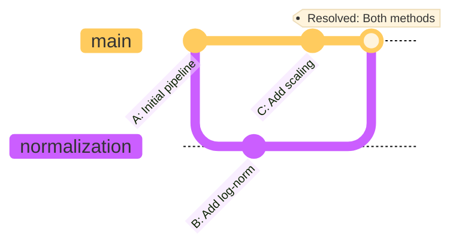
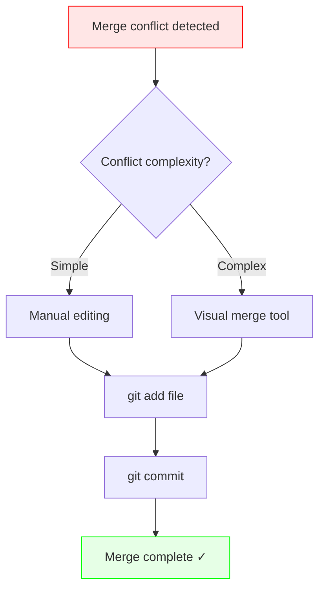

#<h1 align="center">6. Resolving Merge Conflicts</h1>

Merge conflicts happen when Git can't automatically combine changes. Don't panic—they're normal and easy to fix!

---

## What is a Merge Conflict?

A conflict occurs when **two people edit the same part of the same file** and Git doesn't know which version to keep.


###  `git merge` — Combining branches (and resolving conflicts)

Once testing is complete, Dr.X merges her branch back into main.

```bash
git checkout main
git merge normalization
```

#### When conflicts arise — A realistic scenario

While Dr. X was working on log-normalization in the `normalization` branch, Dr. Y was simultaneously updating the same `data_preprocessing.py` file on `main` to add a different scaling method. Now, when Dr. X tries to merge:

!!! terminal "error"

    ```bash
        Auto-merging data_preprocessing.py
        CONFLICT (content): Merge conflict in data_preprocessing.py
        Automatic merge failed; fix conflicts and then commit the result.
    ```

Git cannot automatically decide which changes to keep — just like two scientists editing different parts of the same methods section in a manuscript.

#### Anatomy of a conflict

Opening `data_preprocessing.py`, Dr. X sees conflict markers:
```python
def normalize_counts(adata):
    """Normalize raw count data"""
<<<<<<< HEAD
    # Dr. Y's changes on main branch
    sc.pp.scale(adata, max_value=10)
    print("Applied scaling normalization")
=======
    # Dr. X's changes on normalization branch
    sc.pp.log1p(adata)
    print("Applied log-normalization")
>>>>>>> normalization
    return adata
```

The conflict markers show:
- `<<<<<<< HEAD`: Current branch (main) version
- `=======`: Separator between the two versions
- `>>>>>>> normalization`: Incoming branch version

#### Resolving the conflict

Dr. X realises both normalizations are valuable and should be applied sequentially. They manually edit the file:
```python
def normalize_counts(adata):
    """Normalize raw count data"""
    # Apply both normalization steps
    sc.pp.log1p(adata)
    sc.pp.scale(adata, max_value=10)
    print("Applied log-normalization followed by scaling")
    return adata
```

#### Completing the merge

After resolving all conflicts:

!!! terminal ""

    ```bash
        # Check which files had conflicts
        git status
        
        # Stage the resolved file
        git add data_preprocessing.py
        
        # Complete the merge with a commit
        git commit -m "Merge normalization branch: combine log and scale methods"
    ```

!!! tip "Conflict prevention tips"
    - Communicate with collaborators about which files you're editing
    - Pull frequently to stay synchronized: `git pull origin main`
    - Keep branches short-lived and focused
    - Use `git fetch` + `git diff origin/main` to preview incoming changes


#### Advanced: Using merge tools

For complex conflicts, Dr. X can use visual merge tools:
```bash
# Configure a merge tool (e.g., VS Code, Meld, or vimdiff)
git config --global merge.tool vscode
git config --global mergetool.vscode.cmd 'code --wait --diff $LOCAL $REMOTE'

# Launch the merge tool
git mergetool
```

This opens a side-by-side comparison, making it easier to see differences and choose the correct resolution.



---

!!! success "Key Takeaways"
    - ✅ Conflicts happen when same lines are edited differently
    - ✅ Conflict markers: `<<<<<<<`, `=======`, `>>>>>>>`
    - ✅ Resolution: Edit file → Remove markers → Stage → Commit
    - ✅ Use `git merge --abort` if you want to cancel
    - ✅ Tools like VS Code make conflicts easier to resolve
    - ✅ Communication with team prevents many conflicts
