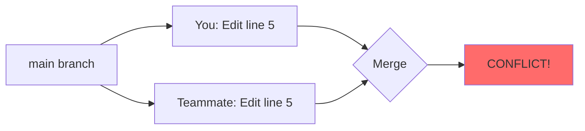

#<h1 align="center">Resolving Merge Conflicts 🔀</h1>

Merge conflicts happen when Git can't automatically combine changes. Don't panic—they're normal and easy to fix!

---

## What is a Merge Conflict?

A conflict occurs when **two people edit the same part of the same file** and Git doesn't know which version to keep.

### When Conflicts Happen



**Example scenario:**
- You change line 5 to: `title = "Hello World"`
- Your teammate changes line 5 to: `title = "Welcome"`
- Git doesn't know which to keep → **Conflict!**

---

## Step-by-Step: Resolving Conflicts

### Step 1: Identify the Conflict

When you try to merge (or pull), Git will tell you:

```bash
$ git merge feature-branch
Auto-merging index.html
CONFLICT (content): Merge conflict in index.html
Automatic merge failed; fix conflicts and then commit the result.
```

Check which files have conflicts:

```bash
$ git status
Unmerged paths:
  both modified:   index.html
```

### Step 2: Open the Conflicted File

Open `index.html` and you'll see conflict markers:

```html
<body>
    <h1>My Website</h1>
<<<<<<< HEAD
    <p>Welcome to my site!</p>
=======
    <p>Hello and welcome!</p>
>>>>>>> feature-branch
</body>
```

**What these markers mean:**

- `<<<<<<< HEAD` - Your current branch's version (starts here)
- `=======` - Separator between the two versions
- `>>>>>>> feature-branch` - The incoming branch's version (ends here)

### Step 3: Decide What to Keep

You have three options:

=== "Keep Your Version"
    ```html
    <body>
        <h1>My Website</h1>
        <p>Welcome to my site!</p>
    </body>
    ```
    Delete: conflict markers + their version

=== "Keep Their Version"
    ```html
    <body>
        <h1>My Website</h1>
        <p>Hello and welcome!</p>
    </body>
    ```
    Delete: conflict markers + your version

=== "Combine Both"
    ```html
    <body>
        <h1>My Website</h1>
        <p>Welcome to my site! Hello and welcome!</p>
    </body>
    ```
    Delete: conflict markers, combine content

=== "Write New Version"
    ```html
    <body>
        <h1>My Website</h1>
        <p>Welcome! Hello everyone!</p>
    </body>
    ```
    Delete: everything, write from scratch

!!! tip "The Key Point"
    **Delete all the conflict markers** (`<<<<<<<`, `=======`, `>>>>>>>`) and keep only the final content you want.

### Step 4: Mark as Resolved

After editing the file:

```bash
# Stage the resolved file
$ git add index.html

# Check status
$ git status
All conflicts fixed but you are still merging.
```

### Step 5: Complete the Merge

```bash
# Commit the merge
$ git commit -m "Resolve conflict in index.html"

# Or if git doesn't open an editor, just:
$ git commit
```

Done! ✅

---

## Quick Reference

### The Conflict Resolution Flow

```bash
# 1. Conflict occurs
$ git merge feature-branch
CONFLICT in file.txt

# 2. Check what's conflicted
$ git status

# 3. Open and edit file.txt
#    - Remove conflict markers
#    - Keep desired content

# 4. Stage the fixed file
$ git add file.txt

# 5. Complete merge
$ git commit -m "Resolve merge conflict"
```

---

## Common Scenarios

### Scenario 1: Pull Conflict

```bash
$ git pull origin main
CONFLICT (content): Merge conflict in app.js

# Fix app.js, then:
$ git add app.js
$ git commit -m "Resolve pull conflict"
```

### Scenario 2: Merge Conflict

```bash
$ git merge feature-login
CONFLICT (content): Merge conflict in login.js

# Fix login.js, then:
$ git add login.js
$ git commit -m "Merge feature-login, resolve conflicts"
```

### Scenario 3: Multiple Files

```bash
$ git merge develop
CONFLICT in file1.js
CONFLICT in file2.js
CONFLICT in file3.js

# Fix each file one by one
$ git add file1.js
$ git add file2.js
$ git add file3.js
$ git commit -m "Resolve all conflicts"
```

---

## Aborting a Merge

Changed your mind? Cancel the merge:

```bash
# Abort and go back to before merge
$ git merge --abort
```

This puts everything back to the state before you started the merge.

---

## Preventing Conflicts

!!! tip "Best Practices"
    1. **Pull often** - Stay up to date with main branch
       ```bash
       git pull origin main
       ```
    
    2. **Communicate** - Tell teammates what files you're editing
    
    3. **Small commits** - Commit frequently, easier to resolve conflicts
    
    4. **Work on different files** - When possible, avoid editing the same files

---

## Tools to Help

### Visual Studio Code

VS Code shows conflicts with buttons:

```
<<<<<<< HEAD (Current Change)
Your code
=======
Their code
>>>>>>> branch-name (Incoming Change)

[Accept Current Change] [Accept Incoming Change] [Accept Both Changes]
```

Just click the button! No manual editing needed.

### Git GUI Tools

- **GitKraken** - Visual conflict resolution
- **SourceTree** - Side-by-side comparison
- **GitHub Desktop** - Simple interface

### Command Line Tools

```bash
# Use merge tool
$ git mergetool

# Or specify a tool
$ git mergetool --tool=vimdiff
```

---

## Understanding Conflict Types

### Content Conflict (Most Common)

**Both branches modified the same lines**

```
<<<<<<< HEAD
const name = "Alice";
=======
const name = "Bob";
>>>>>>> feature
```

**Solution:** Choose one or combine them

### Delete/Modify Conflict

**One branch deleted a file, another modified it**

```bash
$ git status
deleted by us:   file.txt
```

**Solution:** 
- Keep deleted: `git rm file.txt`
- Keep modified: `git add file.txt`

---

## Real Example

Let's walk through a complete example:

### The Setup

**main branch** has:
```python
def greet():
    return "Hello"
```

**feature branch** has:
```python
def greet():
    return "Hi there"
```

### The Conflict

```bash
$ git checkout main
$ git merge feature
CONFLICT in greet.py
```

### The File

```python
def greet():
<<<<<<< HEAD
    return "Hello"
=======
    return "Hi there"
>>>>>>> feature
```

### The Resolution

Edit to:
```python
def greet():
    return "Hello there"
```

### The Completion

```bash
$ git add greet.py
$ git commit -m "Merge feature: combine greetings"
```

✅ **Done!**

---

## Checklist for Resolving Conflicts

When you see a conflict:

- [ ] Don't panic! 😌
- [ ] Run `git status` to see conflicted files
- [ ] Open each conflicted file
- [ ] Find conflict markers (`<<<<<<<`, `=======`, `>>>>>>>`)
- [ ] Decide what to keep
- [ ] **Delete all conflict markers**
- [ ] Test your code works
- [ ] Stage files: `git add <file>`
- [ ] Commit: `git commit`
- [ ] Verify: `git status` should be clean

---

## Common Mistakes

!!! danger "Don't Do This"
    ❌ Commit files with conflict markers still in them
    ```html
    <<<<<<< HEAD
    <h1>Title</h1>
    =======
    ```
    This will break your code!

!!! warning "Remember"
    ✅ Always remove `<<<<<<<`, `=======`, and `>>>>>>>` markers  
    ✅ Test your changes before committing  
    ✅ Don't use `git commit -a` during conflicts (be explicit)

---

## Quick Tips

💡 **Use `git status` often** - Shows what's conflicted and what's resolved

💡 **Resolve one file at a time** - Don't rush, handle each conflict carefully

💡 **Test after resolving** - Make sure code still works!

💡 **Communicate with your team** - Discuss conflicts if unsure which version to keep

💡 **Use a merge tool** - VS Code, GitKraken, etc. make it easier

---

## When to Ask for Help

🤔 **Ask your team when:**
- You don't understand what the code does
- Both versions look important
- The conflict is in a complex file
- You're not sure about the impact

**It's better to ask than to break something!**

---

## Summary

Resolving conflicts is a **3-step process**:

1. **Find** the conflict markers in the file
2. **Edit** the file to keep what you want (remove markers!)
3. **Commit** the resolved file

**Remember:** Conflicts are normal! Every developer deals with them. With practice, they become routine.

---

## Practice Exercise

Try this on a test repository:

```bash
# Create test repo
$ mkdir conflict-practice
$ cd conflict-practice
$ git init

# Create file on main
$ echo "Line 1" > test.txt
$ git add test.txt
$ git commit -m "Initial"

# Create branch and modify
$ git checkout -b feature
$ echo "Line 1 modified in feature" > test.txt
$ git commit -am "Feature change"

# Go back and modify same line
$ git checkout main
$ echo "Line 1 modified in main" > test.txt
$ git commit -am "Main change"

# Create conflict
$ git merge feature
# Now practice resolving!
```

---

<div class="grid" markdown>

[← Back: Branching & Merging](../commands/branching.md){ .md-button }
[Next: Rebasing →](rebasing.md){ .md-button .md-button--primary }

</div>

---

!!! success "Key Takeaways"
    - ✅ Conflicts happen when same lines are edited differently
    - ✅ Conflict markers: `<<<<<<<`, `=======`, `>>>>>>>`
    - ✅ Resolution: Edit file → Remove markers → Stage → Commit
    - ✅ Use `git merge --abort` if you want to cancel
    - ✅ Tools like VS Code make conflicts easier to resolve
    - ✅ Communication with team prevents many conflicts
