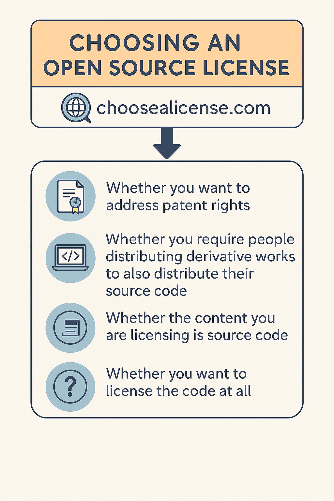

# <h1 align="center"> 7. Licensing</h1>

!!! clipboard-list "Objectives"

    - Explain why adding licensing information to a repository is important.
    - Choose a proper license.
    - Explain differences in licensing and social expectations.

As an open source project, Software Carpentry relies on volunteers to create our lessons and includes a file named LICENSE or LICENSE.txt file in all public lesson repositories. This file is used to specify that all materials are freely available under the Creative Commons Attribution license. Without a file that clearly states under which license any public source code, manuscript or other creative works is being made available, the default copyright laws apply. To learn more about licensing and open source, you can read more about [Github’s description of license](https://docs.github.com/en/repositories/managing-your-repositorys-settings-and-features/customizing-your-repository/licensing-a-repository) and the legal grounds for [open source licensing](https://opensource.guide/legal/#are-public-github-projects-open-source).

!!! circle-info ""
     
    

        
    

    
    
    Choosing a license that is in common use makes life easier for contributors and users, because  they are more likely to already be familiar with the license and don’t have to wade through a    bunch of jargon to decide if they’re ok with it. The [Open Source Initiative](https:// opensource.org/licenses) and [Free Software Foundation](https://www.gnu.org/licenses/    license-list.html) both maintain lists of licenses which are good choices.
    
    [This article](https://www.gnu.org/licenses/license-list.html) provides an excellent overview   of licensing and licensing options from the perspective of scientists who also write code.
    
    At the end of the day what matters is that there is a clear statement as to what the license    is. Also, the license is best chosen from the get-go, even if for a repository that is not     public. Pushing off the decision only makes it more complicated later, because each time a new  collaborator starts contributing, they, too, hold copyright and will thus need to be asked for   approval once a license is chosen.