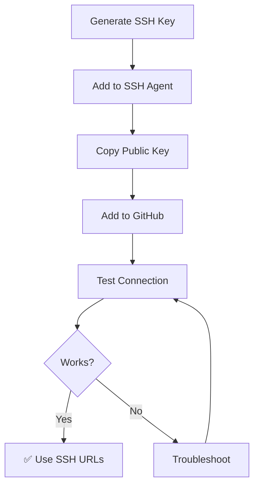

# Setting Up SSH Keys for GitHub 🔑

## Why Use SSH Keys?

SSH keys provide **secure, passwordless** authentication to GitHub. Once set up, you'll never need to enter your username and password again!

### Benefits

✅ **More secure** than passwords  
✅ **No typing credentials** every push/pull  
✅ **Works with 2FA** (Two-Factor Authentication)  
✅ **One-time setup** - lasts for years  
✅ **Industry standard** for developers  

---

## Understanding SSH Keys

Think of SSH keys like a lock and key system:

- **Private key** 🔒 - Stays on your computer (NEVER share this!)
- **Public key** 🔑 - You give this to GitHub

When you push/pull, GitHub uses your public key to verify it's really you.

---

## Step-by-Step Setup

### Step 1: Check for Existing SSH Keys

First, see if you already have SSH keys:

```bash
# Check if you have existing keys
ls -la ~/.ssh
```

**Look for these files:**

- `id_rsa.pub` and `id_rsa` (older format)
- `id_ed25519.pub` and `id_ed25519` (newer, recommended)

??? question "If You See Existing Keys"
    You can either:
    

    - **Use the existing key** - Skip to Step 3
    - **Generate a new key** - Continue to Step 2

---

### Step 2: Generate a New SSH Key

=== "Modern Method (Recommended)"
    

    ```bash
    # Generate Ed25519 key (modern, secure, fast)
    ssh-keygen -t ed25519
    ```

=== "RSA Method (If Ed25519 Not Supported)"
    

    ```bash
    # Generate RSA key (older but widely supported)
    ssh-keygen -t rsa -b 4096
    ```

#### What Happens Next:

```
Generating public/private ed25519 key pair.
Enter file in which to save the key (/home/username/.ssh/id_ed25519):
```

**Just press Enter** to use the default location.

```
Enter passphrase (empty for no passphrase):
```

??? tip "Passphrase - Yes or No?"
    **Recommended:** Add a passphrase for extra security
    

    - **With passphrase:** More secure, need to type it occasionally
    - **Without passphrase:** More convenient, slightly less secure
    
    For learning, no passphrase is fine. For work, use one!

**Press Enter twice** (for no passphrase) or type a passphrase.

**Output:**

```
Your identification has been saved in /home/username/.ssh/id_ed25519
Your public key has been saved in /home/username/.ssh/id_ed25519.pub
The key fingerprint is:
SHA256:XxXxXxXxXxXxXxXxXxXxXxXxXxXxXxXxXxXxXxXx 
```

✅ **Success!** Your SSH key is created.

---

### Step 3: Add SSH Key to SSH Agent

The SSH agent manages your keys and remembers your passphrase.

=== "macOS"
    

    ```bash
    # Start the SSH agent
    eval "$(ssh-agent -s)"
    
    # Add your key to the agent
    ssh-add ~/.ssh/id_ed25519
    
    # For macOS, also add to keychain
    ssh-add --apple-use-keychain ~/.ssh/id_ed25519
    ```

=== "Linux"
    

    ```bash
    # Start the SSH agent
    eval "$(ssh-agent -s)"
    
    # Add your key to the agent
    ssh-add ~/.ssh/id_ed25519
    ```

=== "Windows (Git Bash)"
    

    ```bash
    # Start the SSH agent
    eval "$(ssh-agent -s)"
    
    # Add your key to the agent
    ssh-add ~/.ssh/id_ed25519
    ```

**Output:**

```
Agent pid 12345
Identity added: /home/username/.ssh/id_ed25519 (your.email@example.com)
```

---

### Step 4: Copy Your Public Key

Now get your **public key** to add to GitHub:

=== "macOS"
    
     - simply `cat  ~/.ssh/id_ed25519.pub` and copy the content or use a tool such as `pbcopy`

    ```bash
    # Copy to clipboard
    pbcopy < ~/.ssh/id_ed25519.pub
    ```
       
    
    ✅ Public key is now on your clipboard!

=== "Linux"
    

    ```bash
    # Display the key (then copy manually)
    cat ~/.ssh/id_ed25519.pub
    ```
    
    Or if you have `xclip`:
    ```bash
    # Copy to clipboard
    cat ~/.ssh/id_ed25519.pub | xclip -selection clipboard
    ```

=== "Windows (Git Bash)"
    

    ```bash
    # Copy to clipboard
    clip < ~/.ssh/id_ed25519.pub
    ```
    
    ✅ Public key is now on your clipboard!

**The key looks like this:**

```
ssh-ed25519 AAAAC3NzaC1lZDI1NTE5AAAAIJl3dIeudNqd0DPMRD6OIh65A9pu9hj your.email@example.com
```

!!! warning "Important"
    This is your **PUBLIC** key - safe to share.  
    NEVER share your **PRIVATE** key (the one without `.pub`)!

---

### Step 5: Add SSH Key to GitHub

Now add your key to GitHub:

1. **Go to GitHub** → [github.com](https://github.com)

2. **Click your profile picture** (top right) → **Settings**

3. **In sidebar:** Click **"SSH and GPG keys"**

4. **Click** the green **"New SSH key"** button

5. **Fill in the form:**

   - **Title:** Give it a name (e.g., "My Laptop" or "Work Computer")
   - **Key type:** Leave as "Authentication Key"
   - **Key:** Paste your public key here

6. **Click** "Add SSH key"

7. **Confirm** with your GitHub password if prompted

✅ **Done!** Your SSH key is now on GitHub.

---

### Step 6: Test the Connection

Verify everything works:

```bash
# Test SSH connection to GitHub
ssh -T git@github.com
```

**First time?** You'll see:

```
The authenticity of host 'github.com (IP)' can't be established.
ED25519 key fingerprint is SHA256:...
Are you sure you want to continue connecting (yes/no/[fingerprint])?
```

**Type** `yes` and press Enter.

**Success looks like:**

```
Hi username! You've successfully authenticated, but GitHub does not provide shell access.
```

✅ **Perfect!** SSH is working.

❌ **If you see an error**, see the troubleshooting section below.

---

## Using SSH with GitHub

### For New Repositories

When cloning, use the SSH URL instead of HTTPS:

```bash
# ❌ Old way (HTTPS)
git clone https://github.com/username/repo.git

# ✅ New way (SSH)
git clone git@github.com:username/repo.git
```

### For Existing Repositories

Switch an existing repo from HTTPS to SSH:

```bash
# Check current remote
git remote -v

# Change to SSH
git remote set-url origin git@github.com:username/repo.git

# Verify the change
git remote -v
```

Now when you push/pull, it uses SSH automatically! 🎉

---

## Complete Workflow Example

Here's how it all works together:

### Scenario: Pushing to GitHub

```bash
# 1. Make changes
echo "# My Project" > README.md
git add README.md
git commit -m "Add README"

# 2. Push to GitHub (using SSH)
git push origin main
```

**With SSH:** No password prompt! Just works. ✅

**Without SSH:** Need to enter username and token every time. 😰

---

## Visual Guide



---

## Multiple Computers

You can add SSH keys from multiple devices:

### Option 1: Different Key Per Device (Recommended)

Generate a new key on each computer and add all to GitHub:

- 🖥️ **Desktop:** "Desktop - Linux"
- 💻 **Laptop:** "Laptop - macOS"  
- 🏢 **Work:** "Work Computer"

**Benefits:**

- If one device is compromised, only revoke that key
- Easy to identify which device is which

### Option 2: Copy Same Key to All Devices (Not Recommended)

You *could* copy `id_ed25519` and `id_ed25519.pub` to other computers, but this is less secure.

---

## Advanced Tips

### Tip 1: Use SSH Config for Multiple Accounts

If you have multiple GitHub accounts:

**Create/edit** `~/.ssh/config`:

```bash
# Personal GitHub
Host github.com
  HostName github.com
  User git
  IdentityFile ~/.ssh/id_ed25519_personal

# Work GitHub
Host github-work
  HostName github.com
  User git
  IdentityFile ~/.ssh/id_ed25519_work
```

**Clone work repos:**

```bash
git clone git@github-work:company/repo.git
```

### Tip 2: Set SSH as Default for Git

```bash
# Always use SSH for github.com
git config --global url."git@github.com:".insteadOf "https://github.com/"
```

Now even HTTPS URLs automatically use SSH!

### Tip 3: Auto-start SSH Agent

Add to your `~/.bashrc` or `~/.zshrc`:

```bash
# Auto-start SSH agent
if [ -z "$SSH_AUTH_SOCK" ]; then
   eval "$(ssh-agent -s)"
   ssh-add ~/.ssh/id_ed25519
fi
```

---

## Security Best Practices

!!! danger "Never Do This"
    ❌ Share your private key  
    ❌ Commit private key to Git  
    ❌ Email private key  
    ❌ Put private key in cloud storage  
    ❌ Use same key everywhere without organization  

!!! success "Always Do This"
    ✅ Keep private key on your computer only  
    ✅ Use passphrase for extra security  
    ✅ Add different keys for each device  
    ✅ Remove keys when you lose access to a device  
    ✅ Regularly review your GitHub SSH keys  

### Revoke a Key

If a device is lost or compromised:

1. Go to GitHub → Settings → SSH keys
2. Find the key
3. Click **"Delete"**

That device can no longer access GitHub.

---

## Troubleshooting

### Problem: "Permission denied (publickey)"

**Cause:** SSH key not properly configured

**Solutions:**

```bash
# 1. Check if key is added to agent
ssh-add -l

# 2. If not listed, add it
ssh-add ~/.ssh/id_ed25519

# 3. Test connection again
ssh -T git@github.com
```

### Problem: "Could not open a connection to your authentication agent"

**Cause:** SSH agent not running

**Solution:**

```bash
# Start SSH agent
eval "$(ssh-agent -s)"

# Add key
ssh-add ~/.ssh/id_ed25519
```

### Problem: "Enter passphrase for key"

**Cause:** You set a passphrase and agent forgot it

**Solution:**

```bash
# Re-add key to agent
ssh-add ~/.ssh/id_ed25519

# Enter passphrase when prompted
```

### Problem: Test shows wrong username

**Output:**

```
Hi wrong-username! You've successfully authenticated...
```

**Cause:** Wrong key being used

**Solution:**

```bash
# Check which key is being used
ssh -vT git@github.com

# Look for "identity file" lines
# Make sure the correct key is loaded
```

### Problem: "Host key verification failed"

**Cause:** GitHub's fingerprint changed or SSH config issue

**Solution:**

```bash
# Remove old fingerprint
ssh-keygen -R github.com

# Try connecting again
ssh -T git@github.com

# Type 'yes' when prompted
```

---

## Quick Reference

### Generate Key

```bash
ssh-keygen -t ed25519 -C "your.email@example.com"
```

### Add to Agent

```bash
eval "$(ssh-agent -s)"
ssh-add ~/.ssh/id_ed25519
```

### Copy Public Key (macOS)

```bash
pbcopy < ~/.ssh/id_ed25519.pub
```

### Copy Public Key (Linux)

```bash
cat ~/.ssh/id_ed25519.pub
```

### Copy Public Key (Windows)

```bash
clip < ~/.ssh/id_ed25519.pub
```

### Test Connection

```bash
ssh -T git@github.com
```

### Switch Repo to SSH

```bash
git remote set-url origin git@github.com:username/repo.git
```

---

## Comparison: SSH vs HTTPS vs Tokens

| Feature         | SSH       | HTTPS + Token  | HTTPS + Password |
| --------------- | --------- | -------------- | ---------------- |
| **Security**    | ⭐⭐⭐⭐⭐     | ⭐⭐⭐⭐           | ⭐⭐ (deprecated)  |
| **Setup**       | One-time  | Per-token      | N/A (disabled)   |
| **Convenience** | Automatic | Manual token   | N/A              |
| **Expiration**  | Never     | Can expire     | N/A              |
| **Recommended** | ✅ Yes     | For automation | ❌ Disabled       |

**Winner:** SSH for daily development! 🏆

---

## For the Workshop

When teaching:

1. **Start with this page** before GitHub collaboration
2. **Demo live** - generate key on screen
3. **Have students follow along** - they do it themselves
4. **Test together** - verify everyone's SSH works
5. **Then proceed** to push/pull exercises

**Time needed:** 15-20 minutes for setup


---

!!! success "Key Takeaways"
    - ✅ SSH keys = secure, passwordless GitHub access
    - ✅ Generate once per computer: `ssh-keygen -t ed25519`
    - ✅ Add public key to GitHub (Settings → SSH keys)
    - ✅ Test with: `ssh -T git@github.com`
    - ✅ Use SSH URLs: `git@github.com:user/repo.git`
    - ✅ Never share private key!