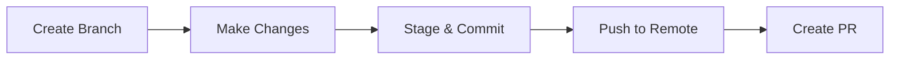
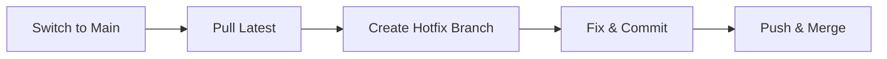

# Git Command Generator 🎯

Never memorize Git commands again! Use this interactive tool to find the exact command you need.

## Interactive Command Builder

<iframe src="../assets/git-command-generator.html" 
        width="100%" 
        height="900px" 
        style="border: 2px solid #667eea; border-radius: 12px;">
</iframe>

---

## How to Use

1. **Select what you want to do** - Choose from common Git operations
2. **Pick the specific action** - Narrow down your exact need
3. **Enter any required values** - Branch names, file names, etc.
4. **Copy and use!** - Click the copy button and paste into your terminal

---

## Quick Examples

### Example 1: Creating a Feature Branch

1. Select "Work with branches"
2. Choose "Create and switch to new branch"
3. Enter your branch name: `feature/login`
4. Get: `git checkout -b feature/login`

### Example 2: Undoing Last Commit

1. Select "Undo changes"
2. Choose "Undo last commit, keep changes unstaged"
3. Get: `git reset HEAD~1`

### Example 3: Pushing to Remote

1. Select "Push to remote"
2. Choose "Push and set upstream"
3. Enter branch name: `main`
4. Get: `git push -u origin main`

---

## Common Workflows

### Feature Development Flow

**Commands you'll need:**
- Create branch: Select "branch" → "Create and switch"
- Stage changes: Select "add" → "Stage all changes"
- Commit: Select "commit" → "Commit with message"
- Push: Select "push" → "Push and set upstream"

### Bug Fix Flow

**Commands you'll need:**
- Switch branch: Select "checkout" → "Switch to existing branch"
- Pull updates: Select "pull" → "Pull from remote branch"
- Create branch: Select "branch" → "Create and switch"

---

## Safety Tips

!!! warning "Destructive Commands"
    Some commands can't be undone. The tool will warn you when:
    
    - Using `--force` (rewrites history)
    - Using `--hard` (deletes changes)
    - Clearing stashes (loses saved work)
    
    Always read warnings before executing!

!!! tip "Test First"
    Not sure about a command? Try it on a test repository first!

!!! info "Local vs Remote"
    Remember:
    
    - Commands run locally by default
    - Use `push` to send changes to remote
    - Use `pull` to get changes from remote
---

## Need More Help?

- 📚 [Complete Cheat Sheet](cheat-sheet.md) - All commands with examples
- 🏠 [Workshop Home](../index.md) - Return to overview

---

## About This Tool

This interactive command generator helps you:

✅ Find commands without googling  
✅ Learn proper syntax  
✅ Understand what each command does  
✅ Avoid common mistakes  
✅ Build confidence with Git  

**Made with ❤️ for the Git Workshop**
