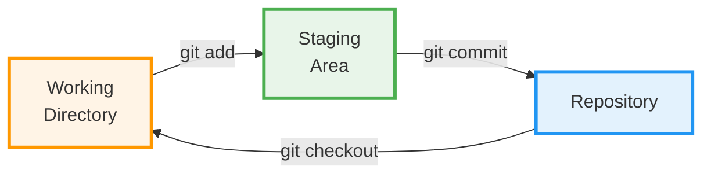

# <h1 align="center">Visualising Git Workflow</h1>

<p align="center">
    
</p>

## The Git Workflow

Git has a three-stage architecture that gives you precise control over what gets saved in your project history.

### The Three States

Every file in Git exists in one of three states:

#### 1. 📁 Working Directory

This is your **workspace** - where you actually edit files.

```bash
# Your project folder
my-project/
├── index.html      ← Edit this file
├── style.css       ← Make changes here
└── script.js       ← Work on your code
```

!!! info "Working Directory"
    - Where you make changes to files
    - Just a normal folder on your computer
    - Changes here are NOT tracked yet

#### 2. 📋 Staging Area (Index)

This is the **preparation zone** - where you choose which changes to include in your next commit.

```bash
# You edited 5 files, but only want to commit 3
$ git add index.html style.css
# Now these 2 files are "staged" and ready to commit
```

!!! tip "Why Staging?"
    The staging area lets you craft **perfect commits**. You can:
    
    - Group related changes together
    - Commit features one at a time
    - Review changes before committing
    - Leave unfinished work unstaged

#### 3. 🗄️ Repository (Local Repo)

This is your **permanent history** - where Git stores all committed snapshots.

```bash
$ git commit -m "Add login feature"
# Your staged changes are now permanently saved in Git's history
```

!!! success "Repository"
    - Complete project history
    - Stored in the hidden `.git` folder
    - Can recover any previous version
    - Shareable with others

---

## The Basic Git Workflow

Here's how the typical workflow looks:

### Step-by-Step Example

=== "Step 1: Modify Files"
    ```bash
    # Edit your files in the working directory
    $ nano index.html  # Make some changes
    ```
    
    **Status**: Changes are in Working Directory ⚠️ (not tracked)

=== "Step 2: Stage Changes"
    ```bash
    # Add files to staging area
    $ git add index.html
    ```
    
    **Status**: Changes are Staged ✓ (ready to commit)

=== "Step 3: Commit"
    ```bash
    # Commit staged changes with a message
    $ git commit -m "Update homepage header"
    ```
    
    **Status**: Changes are Committed 🎉 (saved in history)

=== "Step 4: Repeat"
    ```bash
    # Continue working...
    $ nano style.css      # Modify
    $ git add style.css   # Stage
    $ git commit -m "Fix button colors"  # Commit
    ```

---

## Visualizing the Workflow


