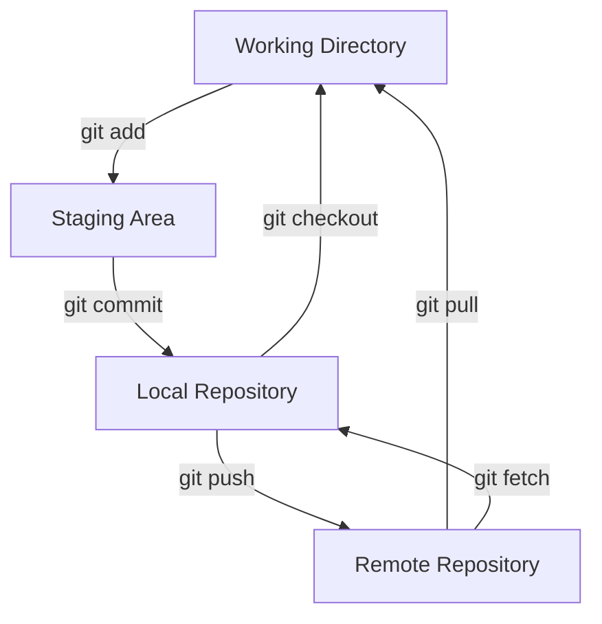

# Git & GitHub Cheat Sheet 📋

Quick reference for the most common Git and GitHub commands.

---

## Setup & Configuration

### Initial Setup

```bash
# Set your identity
git config --global user.name "Your Name"
git config --global user.email "your.email@example.com"

# Set default branch name
git config --global init.defaultBranch main

# Set default editor
git config --global core.editor "code --wait"  # VS Code
git config --global core.editor "nano"         # Nano

# View all settings
git config --list

# View specific setting
git config user.name
```

### Aliases (Shortcuts)

```bash
# Create shortcuts for common commands
git config --global alias.st status
git config --global alias.co checkout
git config --global alias.br branch
git config --global alias.ci commit
git config --global alias.unstage 'reset HEAD --'

# Now you can use:
git st    # instead of git status
git co    # instead of git checkout
```

---

## Creating Repositories

=== "New Local Repository"
    ```bash
    # Create a new directory
    mkdir my-project
    cd my-project
    
    # Initialize Git
    git init
    ```

=== "Clone Existing Repository"
    ```bash
    # Clone via HTTPS
    git clone https://github.com/user/repo.git
    
    # Clone via SSH
    git clone git@github.com:user/repo.git
    
    # Clone to specific folder
    git clone https://github.com/user/repo.git my-folder
    
    # Clone specific branch
    git clone -b develop https://github.com/user/repo.git
    ```

---

## Basic Workflow

### Checking Status

```bash
# Show working tree status
git status

# Short format
git status -s

# Show branch and tracking info
git status -sb
```

### Staging Changes

```bash
# Stage specific file
git add filename.txt

# Stage all changes in current directory
git add .

# Stage all changes in repository
git add -A

# Stage by pattern
git add *.js

# Interactive staging
git add -p

# Remove from staging (unstage)
git reset filename.txt
```

### Committing

```bash
# Commit staged changes
git commit -m "Your commit message"

# Commit with detailed message
git commit -m "Title" -m "Description"

# Stage and commit tracked files
git commit -am "Message"

# Amend last commit
git commit --amend -m "New message"

# Commit with specific date
git commit --date="2025-01-01 12:00:00" -m "Message"
```

---

## Viewing History

```bash
# View commit history
git log

# One line per commit
git log --oneline

# Show last N commits
git log -n 5

# Show with graph
git log --graph --oneline --all

# Show with files changed
git log --stat

# Show with actual changes
git log -p

# Show commits by author
git log --author="John"

# Show commits since date
git log --since="2025-01-01"

# Show commits for specific file
git log -- filename.txt

# Pretty format
git log --pretty=format:"%h - %an, %ar : %s"
```

---

## Branching

### Creating & Switching Branches

```bash
# List all branches
git branch

# List all branches (including remote)
git branch -a

# Create new branch
git branch feature-name

# Switch to branch
git checkout feature-name

# Create and switch to new branch
git checkout -b feature-name

# Create branch from specific commit
git branch feature-name abc123

# Switch to previous branch
git checkout -

# Rename current branch
git branch -m new-name

# Delete branch
git branch -d feature-name

# Force delete branch
git branch -D feature-name
```

### Merging

```bash
# Merge branch into current branch
git merge feature-name

# Merge with no fast-forward
git merge --no-ff feature-name

# Abort merge
git merge --abort

# See merged branches
git branch --merged

# See unmerged branches
git branch --no-merged
```

---

## Remote Repositories

### Managing Remotes

```bash
# List remotes
git remote -v

# Add remote
git remote add origin https://github.com/user/repo.git

# Change remote URL
git remote set-url origin https://github.com/user/repo.git

# Remove remote
git remote remove origin

# Rename remote
git remote rename origin upstream

# Show remote info
git remote show origin
```

### Fetching & Pulling

```bash
# Fetch all remotes
git fetch --all

# Fetch specific remote
git fetch origin

# Fetch and prune deleted branches
git fetch --prune

# Pull (fetch + merge)
git pull origin main

# Pull with rebase
git pull --rebase origin main
```

### Pushing

```bash
# Push to remote
git push origin main

# Push and set upstream
git push -u origin main

# Push all branches
git push --all origin

# Push tags
git push --tags

# Delete remote branch
git push origin --delete feature-name

# Force push (dangerous!)
git push --force origin main

# Force push (safer)
git push --force-with-lease origin main
```

---

## Undoing Changes

### Discard Changes

```bash
# Discard changes in working directory
git checkout -- filename.txt

# Discard all changes
git checkout -- .

# Remove untracked files
git clean -f

# Remove untracked files and directories
git clean -fd

# Preview what will be removed
git clean -n
```

### Unstaging

```bash
# Unstage file
git reset HEAD filename.txt

# Unstage all
git reset HEAD
```

### Reverting Commits

```bash
# Create new commit that undoes changes
git revert abc123

# Revert last commit
git revert HEAD

# Revert without committing
git revert -n abc123
```

### Resetting

```bash
# Soft reset (keep changes staged)
git reset --soft HEAD~1

# Mixed reset (keep changes unstaged)
git reset HEAD~1

# Hard reset (discard all changes)
git reset --hard HEAD~1

# Reset to specific commit
git reset --hard abc123

# Reset specific file
git checkout abc123 -- filename.txt
```

---

## Stashing

```bash
# Stash changes
git stash

# Stash with message
git stash save "Work in progress"

# List stashes
git stash list

# Apply most recent stash
git stash apply

# Apply and remove stash
git stash pop

# Apply specific stash
git stash apply stash@{1}

# Drop specific stash
git stash drop stash@{0}

# Clear all stashes
git stash clear

# Stash untracked files too
git stash -u

# Create branch from stash
git stash branch feature-name
```

---

## Comparing & Diffing

```bash
# Show unstaged changes
git diff

# Show staged changes
git diff --staged

# Show changes between commits
git diff abc123 def456

# Show changes for specific file
git diff filename.txt

# Show changes between branches
git diff main feature-branch

# Show summary of changes
git diff --stat

# Show word-by-word changes
git diff --word-diff
```

---

## Tags

```bash
# List tags
git tag

# Create lightweight tag
git tag v1.0.0

# Create annotated tag
git tag -a v1.0.0 -m "Version 1.0.0"

# Tag specific commit
git tag v1.0.0 abc123

# Show tag info
git show v1.0.0

# Push tag to remote
git push origin v1.0.0

# Push all tags
git push --tags

# Delete local tag
git tag -d v1.0.0

# Delete remote tag
git push origin --delete v1.0.0

# Checkout tag
git checkout v1.0.0
```

---

## Advanced Commands

### Rebasing

```bash
# Rebase current branch onto main
git rebase main

# Interactive rebase (last 3 commits)
git rebase -i HEAD~3

# Continue rebase after resolving conflicts
git rebase --continue

# Skip current commit
git rebase --skip

# Abort rebase
git rebase --abort
```

### Cherry-Picking

```bash
# Apply specific commit to current branch
git cherry-pick abc123

# Cherry-pick without committing
git cherry-pick -n abc123

# Cherry-pick range of commits
git cherry-pick abc123..def456
```

### Searching

```bash
# Search in working directory
git grep "search term"

# Search in specific branch
git grep "search term" branch-name

# Show line numbers
git grep -n "search term"

# Search in commit history
git log -S "search term"

# Find commits that added/removed a string
git log -G "search term"
```

### Bisect (Find Bug)

```bash
# Start bisecting
git bisect start

# Mark current as bad
git bisect bad

# Mark commit as good
git bisect good abc123

# Git will checkout middle commit
# Test it, then mark as good or bad
git bisect good  # or git bisect bad

# When found, reset
git bisect reset
```

---

## GitHub-Specific

### Pull Requests

```bash
# Create PR from command line (using GitHub CLI)
gh pr create --title "Feature" --body "Description"

# List PRs
gh pr list

# Check out a PR
gh pr checkout 123

# Merge PR
gh pr merge 123

# View PR in browser
gh pr view 123 --web
```

### Issues

```bash
# Create issue
gh issue create --title "Bug" --body "Description"

# List issues
gh issue list

# Close issue
gh issue close 123

# View issue
gh issue view 123
```

---

## Useful Combinations

```bash
# View files changed in last commit
git show --name-only HEAD

# List files in commit
git diff-tree --no-commit-id --name-only -r abc123

# Count commits by author
git shortlog -sn

# Find who modified a line
git blame filename.txt

# Show commit that introduced a change
git log --follow -- filename.txt

# Create archive of repository
git archive --format=zip HEAD > project.zip

# Export repository without .git
git clone --depth 1 <url> folder && rm -rf folder/.git

# Temporarily ignore file
git update-index --assume-unchanged filename.txt

# Stop ignoring file
git update-index --no-assume-unchanged filename.txt
```

---

## .gitignore Patterns

```bash
# Ignore specific file
config.ini

# Ignore all files with extension
*.log

# Ignore directory
node_modules/

# Ignore all .txt files in specific directory
logs/*.txt

# But don't ignore this file
!important.txt

# Ignore files only in root
/build

# Ignore all .js files in any directory named "temp"
**/temp/*.js
```

---

## Troubleshooting

```bash
# Fix "detached HEAD"
git checkout main

# Recover deleted branch
git reflog
git checkout -b recovered-branch abc123

# Find lost commits
git reflog
git cherry-pick abc123

# Fix wrong commit message
git commit --amend -m "Correct message"

# Undo last commit but keep changes
git reset --soft HEAD~1

# Sync fork with upstream
git remote add upstream <url>
git fetch upstream
git checkout main
git merge upstream/main
git push origin main

# Remove file from Git but keep locally
git rm --cached filename.txt

# Rename file (Git tracks rename)
git mv old-name.txt new-name.txt
```

---

## Performance & Maintenance

```bash
# Optimize repository
git gc

# Verify integrity
git fsck

# Show repository size
git count-objects -vH

# Prune unreachable objects
git prune

# Remove all untracked files and directories
git clean -fdx
```

---

## Quick Reference Card

| Operation | Command |
|-----------|---------|
| Initialize | `git init` |
| Clone | `git clone <url>` |
| Status | `git status` |
| Stage | `git add <file>` |
| Commit | `git commit -m "message"` |
| Push | `git push origin main` |
| Pull | `git pull origin main` |
| Branch | `git checkout -b <name>` |
| Merge | `git merge <branch>` |
| Stash | `git stash` |
| Log | `git log --oneline` |
| Diff | `git diff` |
| Reset | `git reset HEAD~1` |
| Revert | `git revert <commit>` |

---

## Visual Git Cheatsheet



---

!!! success "Pro Tip"
    Save this cheat sheet as a PDF or bookmark this page for quick reference during your daily work!

---

<div class="grid" markdown>

[← Back to Resources](../resources/further-reading.md){ .md-button }
[Download PDF Version](#){ .md-button .md-button--primary }

</div>
